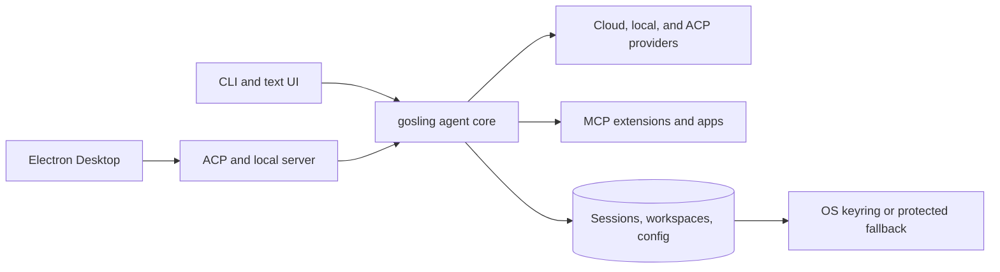

<div align="center">


# gosling

_a lighter goose — your native open source AI agent for code, workflows, and everything in between_

<p align="center">
  <a href="https://opensource.org/licenses/Apache-2.0"
    ></a>
</p>
</div>

gosling is a general-purpose AI agent that runs on your machine. Not just for code — use it for research, writing, automation, data analysis, or anything you need to get done.

A native desktop app for macOS, Linux, and Windows. A full CLI for terminal workflows. An API to embed it anywhere. Built in Rust for performance and portability.

gosling works with 15+ providers — Anthropic, OpenAI, Google, Ollama, OpenRouter, Azure, Bedrock, and more. Use API keys or your existing Claude, ChatGPT, or Gemini subscriptions via ACP. Connect to 70+ extensions via the [Model Context Protocol](https://modelcontextprotocol.io/) open standard.

## Provenance

gosling is an independently maintained descendant of [goose](https://github.com/aaif-goose/goose) **v1.38**, the open source AI agent from the [Agentic AI Foundation (AAIF)](https://aaif.io/) at the Linux Foundation. The inherited framework and commit history remain credited to the goose project and its contributors. gosling is licensed under Apache 2.0 and is not endorsed by or affiliated with goose, AAIF, or the Linux Foundation. See [CONTRIBUTORS.md](CONTRIBUTORS.md) for the independent-fork boundary and attribution details.

## Vision

gosling aims to be a **lighter version of goose**: the same trusted agent core with a smaller footprint, a simpler surface, and faster iteration. The goal is an agent you can install next to (or instead of) goose that stays lean — fewer moving parts, quicker startup, and an easier codebase to remix for custom distributions.

## Footprint & performance vs. goose

Comparison performed **2026-07-04** between release builds of `goose-cli` from `goose` v1.41.0 (commit `181cbbe`) and `gosling` v0.0.5 (commit `5b7d039`), on the same host with matched Cargo feature flags. `code-mode` was excluded from both because this environment blocked the `v8-goose` static-library download. These are historical baseline measurements, not v1.0.0 benchmark claims; rerun them before publishing current performance deltas.

| | goose | gosling | Δ |
|---|---|---|---|
| Cargo.lock packages | 1251 | 1065 | -186 (-15%) |
| Binary size (stripped) | 151 MB | 117 MB | -22% |
| `target/release` build dir | 3.8 GB | 2.4 GB | -37% |
| Build time (wall) | 17m12s | 11m26s | -33% |
| Runtime shared libs (`ldd`) | libstdc++, libgcc_s, libm, libc | libgcc_s, libm, libc | no libstdc++ |
| `--version` cold start | 8.4ms avg / 24.0 MB peak RSS | 6.1ms avg / 17.7 MB peak RSS | -27% time, -26% mem |
| `doctor` cold start | 8.8ms avg / 28.9 MB peak RSS | 6.3ms avg / 22.0 MB peak RSS | -29% time, -24% mem |

The footprint reduction traces to the local-inference stack (candle, llama.cpp, MLX, Hugging Face downloads — 148 crates) that gosling extracts, along with dropping the `recipe`, `schedule`, `gateway`, and `local-models` subcommands. 

### Key Performance & Resource Optimizations

In addition to footprint reduction, Gosling implements several targeted performance enhancements to reduce CPU overhead, memory footprint, and latency in hot paths:

* **Smart Configuration & Secret Caching**: In upstream, `Config::load` re-read, parsed, and deep-cloned the entire configuration mapping on every parameter/secret lookup (~300 call sites, several per turn). Gosling introduces a `ConfigSnapshot` cache using file modification times (mtimes) and lengths, sharing the parsed mapping behind an `Arc`. Lookups are now zero-clone cache hits.
* **Cached Keyring Failures**: Platform keyring access failures (e.g. locked keychain in a headless or SSH session) are now cached (`KEYRING_RUNTIME_DISABLED`) to immediately fallback to file-based secret storage, preventing repeated slow OS keyring timeouts that block the runtime.
* **Process-Wide Token Counter Cache**: Gosling replaces short-lived token counter instances with a process-wide `shared_token_counter` wrapping an LRU cache (size 1024). This persists tokenizations across agent turns, avoiding redundant re-encoding of unchanged conversation prefixes during usage estimation and compaction checks.
* **Offloaded Tokenizer Setup**: Tokenizer BPE ranking table construction is CPU-heavy. Gosling offloads this from async worker threads using `tokio::task::spawn_blocking` and caches the result behind a `OnceCell` to prevent blocking the async runtime.
* **Hot Path Allocation Trimming**: 
  - **Repetition Inspector**: Replaced short-lived temporary inspector clones in the tool loop with `would_exceed_limit` checks using borrowed data, removing unnecessary map allocations.
  - **Telemetry Clients**: Telemetry (Posthog) now reuses a single static `reqwest::Client` with an explicit 10s timeout, instead of creating a connection pool per event, preventing socket exhaustion.
* **Memory & Event Bus Bounds**: Bound event buses and replay buffers with LRUs, and capped in-memory subprocess stdio logs to prevent unbounded memory growth during long-running sessions.

### Key Security Hardening

Relative to the inherited baseline, gosling implements several safety and security hardening improvements:

* **Fail-Closed Tool Inspection**: In upstream, if a tool inspector encountered an error (e.g., timeout, network issue, or internal error), it logged the error and allowed the loop to continue. Because the permission baseline in auto-approval mode is `Allow`, a failing safety inspector would silently let tools execute ungated. Gosling fixes this by synthesizing a `RequireApproval` safety action when a tool inspector fails, forcing execution to halt for manual human approval.
* **Confined MCP Cache & Memory Tool Paths (Directory Traversal Hardening)**: 
  - Restricts the MCP `cache` command to the sandbox/cache directory via path canonicalization and membership verification, preventing directory traversal injections from reading or deleting files outside the sandbox.
  - Validates memory categories in the MCP memory server to ensure they are single, ordinary path components, preventing path traversal reads/writes.
* **Restricted File & Directory Permissions**: 
  - Enforces safe file permissions (`0o600`) for token and session files containing sensitive API keys and OAuth tokens.
  - Restricts the session database directory (`sessions.db` along with SQLite `-wal` and `-shm` sidecar files) to owner-only access (`0o700`), keeping conversation history and echoed secrets protected from other local users.
* **Option Injection Protection**: Added `--` end-of-options guards to `git clone` during plugin installation, preventing command/option injection attacks via malicious URL strings starting with a hyphen.
* **Safer Defaults for Agent Execution**: Tightened default agent permissions and fail-safe paths around code execution, provider configuration, and security scanning so uncertain states move toward review instead of silent execution.

### Feature Comparison

| Feature | Goose | Gosling | Notes |
|---|---|---|---|
| **Core AI Agent Engine** | Yes | Yes | Both support standard LLM chat and tool-calling loops. |
| **Model Context Protocol (MCP)** | Yes | Yes | Full compatibility with 70+ external extensions and tools. |
| **Cloud Providers** | 15+ | 15+ | Anthropic, OpenAI, Gemini, Ollama, OpenRouter, Azure, Bedrock, etc. |
| **Local Inference/Models** | **Yes** | **No** | Goose bundles candle, MLX, llama.cpp, and Hugging Face loaders. Gosling removed these to stay lightweight. |
| **CLI Command Suite** | `goose`, `goose serve`, `recipe`, `schedule`, `gateway`, `local-models` | `gosling`, `gosling serve` | Gosling drops `recipe`, `schedule`, `gateway`, and `local-models` subcommands. |
| **Coexistence** | No | **Yes** | Gosling is fully deconflicted and runs cleanly side-by-side with Goose (isolated configs, databases, keyring, and deep links). |
| **Context Manager MVP** | No | **Yes** | Gosling features an MVP context manager with localized LLM summarization and a `FileMemorySource` backend for retrieved memory. |
| **Fail-Closed Tool Inspection** | No | **Yes** | Gosling escalates safety/security inspector failures to RequireApproval. Goose fails open. |
| **Path Sandbox Enforcement** | Weak | **Yes** | Gosling restricts directory traversals (`../`) in memory/cache extensions. |

## What's included in gosling v1.0.0

- **Workspace-aware Desktop chats** - workspace rows filter the chat list without changing the default for future chats. Starting a chat from a workspace action preselects that workspace, while the global New Chat flow keeps workspace choice explicit.
- **Credential profiles in chat** - the chat composer exposes the credential-profile selector and manager, shows a session's pinned profile, and keeps missing-profile failures visible instead of silently choosing another credential.
- **Desktop lifecycle and windowing reliability** - startup, shutdown, backend cleanup, single-instance behavior, packaged loopback connectivity, and native multi-window actions have dedicated repair and replay evidence.
- **Session and CLI correctness** - persisted interrupted turns, provider failures, machine-readable output, malformed configuration, doctor behavior, empty-input rejection, and ACP lifecycle handling were repaired through the 2026-07-20 playtest campaign.
- **Context and memory** - local summarization, durable file-backed facts, backend-specific routing, compacted-session resume paging, and bounded handoff design support longer-running work.
- **Security hardening** - tool inspection fails closed, secret and session storage use restricted permissions, sensitive writes are atomic, provider clients are bounded, and plugin/cache/path handling rejects unsafe inputs.
- **ACP, MCP, and provider integration** - custom ACP requests, MCP app proxy routes, generated SDK/OpenAPI surfaces, external extensions, and subscription-backed provider adapters remain part of the supported integration model.
- **Independent project stewardship** - release, contributor, provenance, architecture, test-scenario, audit, and user-manual surfaces now identify gosling's independent maintenance boundary without erasing inherited authorship.

## What's new since the fork

- **New name, new mark** — the goose branding has been replaced by gosling: a fresh flying-gosling logo across the desktop app, tray, docs, and installers.
- **Runs side by side with goose** — gosling is fully deconflicted from an existing goose install:
  - separate config/data/state directories (`~/.config/goose` vs `~/.config/gosling`, etc.)
  - separate OS keyring service (`gosling`) for provider credentials
  - its own `gosling://` deep-link scheme (goose keeps `goose://`)
  - its own app identity (`Gosling.app` / `Gosling.exe` / `Gosling` packages) and updater feed
  - single-instance behavior is preserved per app: one running Goose and one running Gosling, each guarded by its own instance lock
- **Provenance in the app** - Help > About identifies gosling and its goose v1.38 lineage.

## Tagteam provider

gosling includes a built-in `tagteam` provider for profile-backed multi-model workflows.

- `coding-adversarial`: `tagteam` adversarial mode with `codex:gpt-5.4-high` as coder and `claude:sonnet-5-high` as adversary.
- `relay`: `tagteam` relay mode with `claude:opus-4.8` supervisor, `codex:gpt-5.4-mini` worker, and `agy:gemini-3.5-flash-medium` scout.
- `supervisor-worker`: `tagteam` supervisor mode with `codex:gpt-5.5-high` supervisor and `codex:codex-5.3-codex/spark-high` worker.

```bash
gosling run --provider tagteam --model <profile> --text "..."
```

`tagteam` and the underlying vendor CLIs must be installed and authenticated separately; gosling does not handle that setup.

## Architecture



The Rust core owns agent execution, provider contracts, permissions, session persistence, and MCP integration. Electron and terminal interfaces use those shared contracts rather than maintaining separate agent behavior. See the [architecture overview](docs/architecture.md) and [documentation architecture section](documentation/docs/gosling-architecture/) for deeper design material.

## Release validation status

The [2026-07-20 live playtest](docs/cloud/2026-07-20-live-all-scenarios-playtest.md) executed all 110 scenario cards. Its initial result was 46 pass, 32 fail, and 32 blocked; the appended repair closure records focused regression evidence for all 15 findings, including an installed Apple Silicon Desktop windowing replay. The initial ledger was not rewritten as a 110-card post-repair pass.

Before publishing v1.0.0, the release owner must complete the [release checklist](RELEASE_CHECKLIST.md), including the full build, test, Clippy, packaged-GUI, and version-alignment gates. Documentation preparation alone is not release validation.

## Known limits

- Local model runtimes are not bundled; use a supported provider or a separately managed local provider such as Ollama.
- Workspace management and credential profiles are currently Desktop features; the CLI uses its working directory and global provider configuration.
- `tagteam` and vendor subscription CLIs require separate installation and authentication.
- Official Homebrew formula and cask distribution are not currently documented as available.
- Historical audit and playtest records describe the exact revision and environment they tested; they are evidence, not evergreen claims about every later build.

## Get started

Install a published build from the [latest GitHub release](https://github.com/repo-makeover/gosling/releases/latest), or follow the [installation manual](documentation/docs/getting-started/installation.md). After installation, confirm the artifact you received:

```bash
gosling --version
```

To build the desktop app or CLI from source:

```bash
source bin/activate-hermit
cargo build --release          # CLI
just run-ui                    # desktop app
```

See [BUILDING_LINUX.md](BUILDING_LINUX.md), [BUILDING_DOCKER.md](BUILDING_DOCKER.md), and [ui/desktop/README.md](ui/desktop/README.md) for platform-specific instructions.

## Quick links

- [Documentation index](documentation/INDEX.md) - user manuals, architecture, publishing, and stewardship
- [v1.0.0 release notes](documentation/docs/release-notes/v1.0.0.md)
- [Release process](RELEASE.md) and [release checklist](RELEASE_CHECKLIST.md)
- [Known issues](documentation/docs/troubleshooting/known-issues.md)
- [Custom Distributions](CUSTOM_DISTROS.md) - build your own distro with preconfigured providers, extensions, and branding
- [Contributing](CONTRIBUTING.md)
- [Contributors and upstream attribution](CONTRIBUTORS.md)

## Upstream compatibility notes

- CLI command names and binaries are renamed from goose's (`gosling`, `goslingd` instead of `goose`, `goosed`); scripts and docs that shell out to `goose`/`goosed` need updating.
- Environment variables and project files are renamed too (`GOSLING_*` instead of `GOOSE_*`; `.goslinghints`/`.gosling/` instead of `.goosehints`/`.goose/`) — see "Runs side by side with goose" above for why, and for the narrow DB/session migration spots that still read the old names during upgrade.

## a little gosling humor 🐥

> Why did the developer switch from goose to gosling?
>
> They wanted the same migrations with less honking! 🚀
