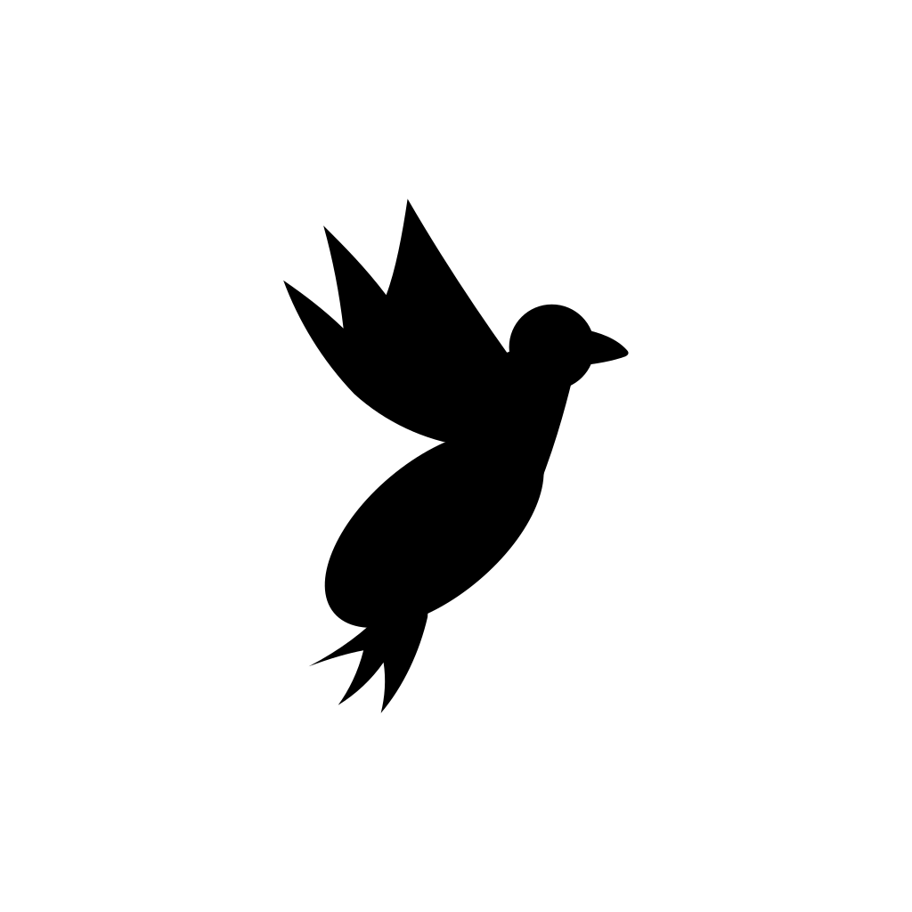

<div align="center">



# gosling

_a lighter goose — your native open source AI agent for code, workflows, and everything in between_

<p align="center">
  <a href="https://opensource.org/licenses/Apache-2.0"
    ></a>
</p>
</div>

gosling is a general-purpose AI agent that runs on your machine. Not just for code — use it for research, writing, automation, data analysis, or anything you need to get done.

A native desktop app for macOS, Linux, and Windows. A full CLI for terminal workflows. An API to embed it anywhere. Built in Rust for performance and portability.

gosling works with 15+ providers — Anthropic, OpenAI, Google, Ollama, OpenRouter, Azure, Bedrock, and more. Use API keys or your existing Claude, ChatGPT, or Gemini subscriptions via ACP. Connect to 70+ extensions via the [Model Context Protocol](https://modelcontextprotocol.io/) open standard.

## Provenance

gosling **v0.0.1** is a fork of [goose](https://github.com/aaif-goose/goose) **v1.38**, the open source AI agent from the [Agentic AI Foundation (AAIF)](https://aaif.io/) at the Linux Foundation. All credit for the underlying agent framework goes to the goose project and its contributors. gosling is licensed under the same Apache 2.0 license and is not endorsed by or affiliated with the goose project or AAIF.

## Vision

gosling aims to be a **lighter version of goose**: the same trusted agent core with a smaller footprint, a simpler surface, and faster iteration. The goal is an agent you can install next to (or instead of) goose that stays lean — fewer moving parts, quicker startup, and an easier codebase to remix for custom distributions.

## What's new in gosling

- **New name, new mark** — the goose branding has been replaced by the gosling: a fresh flying-gosling logo across the desktop app, tray, docs, and installers.
- **Runs side by side with goose** — gosling is fully deconflicted from an existing goose install:
  - separate config/data/state directories (`~/.config/gosling` vs `~/.config/goose`, etc.)
  - separate OS keyring service (`gosling`) for provider credentials
  - its own `gosling://` deep-link scheme (goose keeps `goose://`; gosling still accepts `goose://` session share links for interop)
  - its own app identity (`Gosling.app` / `Gosling.exe` / `Gosling` packages) and updater feed
  - single-instance behavior is preserved per app: one running Gosling and one running Goose, each guarded by its own instance lock
- **Provenance in the app** — Help → About shows that this is Gosling v0.0.1, a fork of goose v1.38.

## Get started

Build the desktop app or CLI from source:

```bash
source bin/activate-hermit
cargo build --release          # CLI
just run-ui                    # desktop app
```

See [BUILDING_LINUX.md](BUILDING_LINUX.md), [BUILDING_DOCKER.md](BUILDING_DOCKER.md), and [ui/desktop/README.md](ui/desktop/README.md) for platform-specific instructions.

## Quick links

- [Documentation source](documentation/) — the gosling docs site
- [Custom Distributions](CUSTOM_DISTROS.md) — build your own distro with preconfigured providers, extensions, and branding
- [Contributing](CONTRIBUTING.md)

## Upstream compatibility notes

- CLI command names and binaries are unchanged (`goose`, `goosed`), so existing scripts and docs keep working; only where state is stored differs.
- `GOOSE_*` environment variables and project files (`.goosehints`, `.goose/`) keep their upstream names for compatibility.

## a little gosling humor 🐥

> Why did the developer switch from goose to gosling?
>
> They wanted the same migrations with less honking! 🚀
