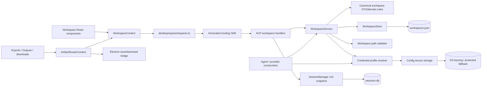
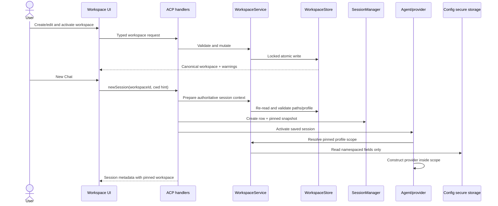

# Gosling Desktop Workspaces architecture

Status: accepted design for REQ-001–REQ-030. See `docs/adr/` for decisions and
`docs/build/io-contract.md` for exact formats and failures.

## Dependency direction

Interface and adapter layers depend on application/domain contracts. The domain never
imports React, Electron, ACP transport, SQLite, keyring libraries, or provider SDK types.

## Primary workflow

## Module contracts

| Module                             | Layer               | Owns                                                                                                 | Must not own                                            | Allowed dependencies                                          | Public surface                                            |
| ---------------------------------- | ------------------- | ---------------------------------------------------------------------------------------------------- | ------------------------------------------------------- | ------------------------------------------------------------- | --------------------------------------------------------- |
| `gosling-sdk-types::workspace`     | domain contract     | canonical DTOs, enums, typed requests/responses                                                      | persistence, provider construction, UI                  | serde/schemars/ACP derive                                     | workspace/profile DTOs and request types                  |
| `gosling::workspace::model`        | domain              | store envelope and internal snapshot conversions                                                     | IO, UI, keyring calls                                   | canonical DTOs                                                | internal versioned record types                           |
| `gosling::workspace::validation`   | domain/application  | normalization, folder status, template/import validation                                             | persistence or UI messages                              | std paths, canonical DTOs                                     | validation report and normalized workspace                |
| `gosling::workspace::store`        | adapter             | lock/read/migrate/atomic-write of workspace metadata                                                 | secret values, session rows, provider creation          | model, fs2, std filesystem                                    | load/mutate/export/import primitives                      |
| `gosling::workspace::credentials`  | application         | metadata lifecycle, secure key naming, scoped resolution                                             | raw keyring API, renderer response values               | store, provider registry metadata, Config                     | create/update/delete/resolve/test profile                 |
| `gosling::workspace::context`      | domain/application  | non-secret session snapshot and prompt rendering                                                     | credentials or global active state                      | canonical DTOs                                                | snapshot builder/prompt renderer                          |
| `gosling::workspace::service`      | application         | CRUD policy, active/default invariants, preparation for sessions                                     | transport/UI/SQLite details                             | store, validator, credentials, context                        | operations used by ACP and Agent                          |
| `acp::server::workspaces`          | interface           | request parsing, error mapping, response mapping                                                     | domain decisions or direct file writes                  | WorkspaceService                                              | `_gosling/unstable/workspaces/*` methods                  |
| `SessionManager` workspace fields  | adapter             | nullable session snapshot columns and queries                                                        | live workspace/profile mutation                         | canonical snapshot DTO                                        | create/copy/read/update/filter snapshot                   |
| `ConfigResolutionScope`            | infrastructure seam | task-scoped logical config/secret resolution                                                         | workspace metadata policy                               | Config secure storage                                         | scoped async execution + typed reads                      |
| `Agent` workspace integration      | application         | use saved profile on create/recreate/resume                                                          | active-workspace selection                              | session snapshot, WorkspaceService, providers                 | fail-closed provider restore and prompt context           |
| `ui/desktop/src/acp/workspaces.ts` | interface adapter   | generated-client calls and no domain state                                                           | persistence, local schema copies                        | generated SDK                                                 | typed async workspace/profile operations                  |
| `WorkspaceContext`                 | UI application      | observable workspace state, mutations, selection/filter derivation                                   | durable persistence or secrets                          | ACP adapter, Electron broadcast                               | required `useWorkspace` API                               |
| `components/workspaces/*`          | UI interface        | accessible presentation/forms/actions                                                                | persistence, session rules, secret retrieval            | WorkspaceContext, existing UI primitives                      | sidebar/editor/profile components                         |
| Electron workspace IPC             | adapter             | folder chooser/reveal and cross-window refresh signal                                                | workspace metadata or secrets                           | typed IPC channels                                            | existing folder APIs + change broadcast                   |
| `ArtifactRouterContext`            | UI application      | pinned/active workspace destination selection, missing-output confirmation, single save API          | durable workspace state, direct filesystem writes       | WorkspaceContext, pure resolver, Electron bridge              | `saveArtifact`, visible-session routing                   |
| Electron artifact bridge           | adapter             | save dialog, authorized full-file copy/content write, revisioned validated native-download placement | workspace persistence, secret data, agent file movement | renderer file-access guard, Node filesystem, Electron session | `save-artifact`, per-window routing config, failure event |

## Seam catalog

| Seam                       | Extension axis                          | Mechanism                                                                    |
| -------------------------- | --------------------------------------- | ---------------------------------------------------------------------------- |
| Workspace schema evolution | future non-secret metadata              | `schema_version`, explicit migrations, top-level unknown-field preservation  |
| Credential auth shapes     | provider config fields                  | provider registry metadata + namespaced logical field resolver               |
| Folder kinds/access        | future folder policies                  | typed enums and centralized validator                                        |
| Product types              | future artifact kinds                   | typed enum set and named output selection helper                             |
| Artifact egress            | future Gosling-owned artifact producers | one `saveArtifact` call plus revision-guarded native `will-download` routing |
| Custom distributions       | additional templates                    | non-secret config template array resolved only on first initialization       |
| Multi-window UI            | additional Desktop windows              | backend source of truth + typed invalidation broadcast                       |
| Legacy sessions            | pre-v22 data                            | nullable snapshot fields and separate legacy fallback path                   |

The design deliberately does not introduce a generic plugin system, arbitrary template
expression language, secret export format, cloud synchronization port, or a second
session store.

## Error taxonomy

| Class       | Examples                                                         | ACP behavior                                             | UI behavior                               |
| ----------- | ---------------------------------------------------------------- | -------------------------------------------------------- | ----------------------------------------- |
| validation  | missing name, invalid enum/path, secret field in import          | invalid params with stable code + safe field details     | inline/actionable warning                 |
| not found   | workspace/profile removed                                        | resource not found                                       | refresh and show deleted/relink state     |
| conflict    | only workspace deletion, referenced profile without confirmation | invalid params/conflict code                             | explicit confirmation or prevented action |
| unavailable | missing primary folder, inaccessible path                        | safe recoverable error                                   | relink/temporary replacement action       |
| credential  | missing secure field/profile, unsupported auth scope             | safe relink/auth-required error; no provider detail dump | configured/missing/needs authentication   |
| storage     | malformed file, lock/rename failure                              | internal error with safe summary and path class          | persistent error state; no crash          |

Logs include method, stable error class, workspace/profile UUID, and path only when needed
for repair. They never include secret request bodies, secret values, or provider error
strings that have not been sanitized.

## Change analysis

- A UI framework swap touches only Desktop context/components and ACP adapter.
- A storage-format swap touches WorkspaceStore/migrations, not UI or session behavior.
- A new provider secret field is discovered through registry metadata and derives its
  namespaced key; it does not require a workspace schema field.
- A new product type changes the canonical enum, generator output, output selector, and
  editor tests; the traceability/test plan pins that fan-out.
- A future cloud-sync design would need a new conflict/identity ADR and is not implied by
  the current store port.
