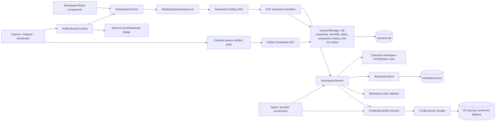
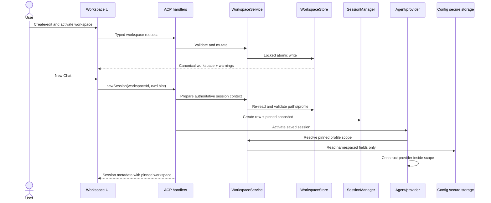
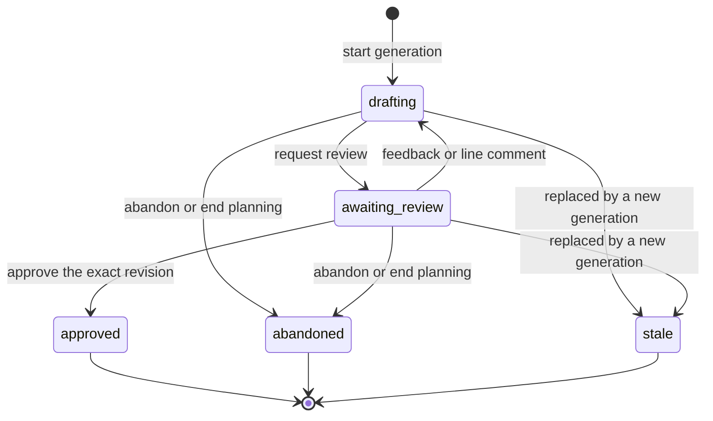

# Gosling Desktop Workspaces architecture

Status: accepted design for REQ-001–REQ-030. See `docs/adr/` for decisions.

The Workspaces I/O contract that this document referenced was pinned to session
schema migration target 22 and was removed with the rest of the completed
campaign's build records; the live schema is well past that, so treat the
formats below as design intent and the code as authoritative.

## Dependency direction

```mermaid
flowchart LR
    UI[Workspace React components] --> Context[WorkspaceContext]
    ArtifactUI[Exports / Outputs / downloads] --> Router[ArtifactRouterContext]
    ArtifactUI --> ArtifactStore[Desktop session artifact state]
    ArtifactStore --> ArtifactACP[Artifact list/update ACP]
    ArtifactACP --> Sessions
    Router --> Context
    Router --> Electron[Electron save/download bridge]
    Context --> DesktopACP[desktop/acp/workspaces.ts]
    DesktopACP --> SDK[Generated Gosling SDK]
    SDK --> Handlers[ACP workspace handlers]
    Handlers --> Service[WorkspaceService]
    Service --> Domain[Canonical workspace DTO/domain rules]
    Service --> Store[WorkspaceStore]
    Service --> Validator[Workspace path validator]
    Service --> Credentials[Credential profile resolver]
    Store --> JSON[(workspaces.json)]
    Credentials --> Config[Config secure storage]
    Config --> Keyring[(OS keyring / protected fallback)]
    Handlers --> Sessions[SessionManager v36 snapshots, handoffs, plans, compaction history, and turn lease]
    Sessions --> DB[(sessions.db)]
    Agent[Agent / provider construction] --> Service
    Agent --> Credentials
```

Interface and adapter layers depend on application/domain contracts. The domain never
imports React, Electron, ACP transport, SQLite, keyring libraries, or provider SDK types.

## Primary workflow

```mermaid
sequenceDiagram
    actor User
    participant UI as Workspace UI
    participant API as ACP handlers
    participant WS as WorkspaceService
    participant Store as WorkspaceStore
    participant Sessions as SessionManager
    participant Agent as Agent/provider
    participant Secrets as Config secure storage

    User->>UI: Create/edit and activate workspace
    UI->>API: Typed workspace request
    API->>WS: Validate and mutate
    WS->>Store: Locked atomic write
    Store-->>UI: Canonical workspace + warnings
    User->>UI: New Chat
    UI->>API: newSession(workspaceId, cwd hint)
    API->>WS: Prepare authoritative session context
    WS->>Store: Re-read and validate paths/profile
    API->>Sessions: Create row + pinned snapshot
    API->>Agent: Activate saved session
    Agent->>WS: Resolve pinned profile scope
    WS->>Secrets: Read namespaced fields only
    Agent->>Agent: Construct provider inside scope
    API-->>UI: Session metadata with pinned workspace
```

An active workspace session may add an existing directory to its own pinned snapshot. That additive
grant updates only the selected session row and its loaded extension clients; it does not mutate the
workspace or sibling sessions. Primary-folder replacement, removal of pinned workspace roots, and
live refresh from later workspace edits remain prohibited. See ADR-0017.

## Module contracts

| Module                              | Layer               | Owns                                                                                                 | Must not own                                            | Allowed dependencies                                          | Public surface                                            |
| ----------------------------------- | ------------------- | ---------------------------------------------------------------------------------------------------- | ------------------------------------------------------- | ------------------------------------------------------------- | --------------------------------------------------------- |
| `gosling-sdk-types::workspace`      | domain contract     | canonical DTOs, enums, typed requests/responses                                                      | persistence, provider construction, UI                  | serde/schemars/ACP derive                                     | workspace/profile DTOs and request types                  |
| `gosling::workspace::model`         | domain              | store envelope and internal snapshot conversions                                                     | IO, UI, keyring calls                                   | canonical DTOs                                                | internal versioned record types                           |
| `gosling::workspace::validation`    | domain/application  | normalization, folder status, template/import validation                                             | persistence or UI messages                              | std paths, canonical DTOs                                     | validation report and normalized workspace                |
| `gosling::workspace::store`         | adapter             | lock/read/migrate/atomic-write of workspace metadata                                                 | secret values, session rows, provider creation          | model, fs2, std filesystem                                    | load/mutate/export/import primitives                      |
| `gosling::workspace::credentials`   | application         | metadata lifecycle, secure key naming, scoped resolution                                             | raw keyring API, renderer response values               | store, provider registry metadata, Config                     | create/update/delete/resolve/test profile                 |
| `gosling::workspace::context`       | domain/application  | non-secret session snapshot and prompt rendering                                                     | credentials or global active state                      | canonical DTOs                                                | snapshot builder/prompt renderer                          |
| `gosling::workspace::service`       | application         | CRUD policy, active/default invariants, preparation for sessions                                     | transport/UI/SQLite details                             | store, validator, credentials, context                        | operations used by ACP and Agent                          |
| `acp::server::workspaces`           | interface           | request parsing, error mapping, response mapping                                                     | domain decisions or direct file writes                  | WorkspaceService                                              | `_gosling/unstable/workspaces/*` methods                  |
| `SessionManager` workspace fields   | adapter             | nullable session snapshot columns and queries                                                        | live workspace/profile mutation                         | canonical snapshot DTO                                        | create/copy/read/update/filter snapshot                   |
| `SessionManager` artifact inventory | adapter             | durable session/path metadata, discovery provenance, legacy message backfill                         | file copies, file reads, or renderer authorization      | persisted messages and successful tool results                | list/upsert/copy/delete artifact metadata                 |
| `ConfigResolutionScope`             | infrastructure seam | task-scoped logical config/secret resolution                                                         | workspace metadata policy                               | Config secure storage                                         | scoped async execution + typed reads                      |
| `Agent` workspace integration       | application         | use saved profile on create/recreate/resume                                                          | active-workspace selection                              | session snapshot, WorkspaceService, providers                 | fail-closed provider restore and prompt context           |
| `ui/desktop/src/acp/workspaces.ts`  | interface adapter   | generated-client calls and no domain state                                                           | persistence, local schema copies                        | generated SDK                                                 | typed async workspace/profile operations                  |
| `WorkspaceContext`                  | UI application      | observable workspace state, mutations, selection/filter derivation                                   | durable persistence or secrets                          | ACP adapter, Electron broadcast                               | required `useWorkspace` API                               |
| `components/workspaces/*`           | UI interface        | accessible presentation/forms/actions                                                                | persistence, session rules, secret retrieval            | WorkspaceContext, existing UI primitives                      | sidebar/editor/profile components                         |
| Electron workspace IPC              | adapter             | folder chooser/reveal and cross-window refresh signal                                                | workspace metadata or secrets                           | typed IPC channels                                            | existing folder APIs + change broadcast                   |
| `ArtifactRouterContext`             | UI application      | pinned/active workspace destination selection, missing-output confirmation, single save API          | durable workspace state, direct filesystem writes       | WorkspaceContext, pure resolver, Electron bridge              | `saveArtifact`, visible-session routing                   |
| Electron artifact bridge            | adapter             | save dialog, authorized full-file copy/content write, exact built-in session-output preview, revisioned validated native-download placement | workspace persistence, secret data, agent file movement | renderer file-access guard, Node filesystem, Electron session | `save-artifact`, per-window routing config, failure event |
| `ArtifactWorkbenchContext`          | UI application      | active session inventory projection plus session-scoped preview tabs/selection                       | inventory persistence or file authorization             | Desktop ACP session store, Electron artifact bridge           | inventory selection and explicit preview actions          |

## Seam catalog

| Seam                       | Extension axis                          | Mechanism                                                                    |
| -------------------------- | --------------------------------------- | ---------------------------------------------------------------------------- |
| Workspace schema evolution | future non-secret metadata              | `schema_version`, explicit migrations, top-level unknown-field preservation  |
| Credential auth shapes     | provider config fields                  | provider registry metadata + namespaced logical field resolver               |
| Folder kinds/access        | future folder policies                  | typed enums and centralized validator                                        |
| Product types              | future artifact kinds                   | typed enum set and named output selection helper                             |
| Artifact egress            | future Gosling-owned artifact producers | one `saveArtifact` call plus revision-guarded native `will-download` routing |
| Artifact discovery         | future tool/result shapes               | ordered metadata-only discovery with session/path idempotency                |
| Custom distributions       | additional templates                    | non-secret config template array resolved only on first initialization       |
| Multi-window UI            | additional Desktop windows              | backend source of truth + typed invalidation broadcast                       |
| Legacy sessions            | pre-v26 data                            | message-only artifact backfill plus existing nullable workspace fallback     |

The design deliberately does not introduce a generic plugin system, arbitrary template
expression language, secret export format, cloud synchronization port, or a second
session store.

## Session artifact inventory

Schema v26 stores artifact metadata in `session_artifacts`; source files stay in place. Successful
write/edit tool targets, local MCP resources, explicit tool metadata/output arguments, and completed
assistant Markdown references are discovered in that order and deduplicated by session plus resolved
path. Bare assistant references try the pinned workspace output and other granted roots after the
working directory, so a named output resolves to the file the session actually produced. Desktop
coalesces an unambiguous qualified-output/dead-bare alias from older inventories and rebinds persisted
preview tabs. Forking copies metadata, deleting a session cascades metadata, and missing files remain named.
Legacy migration parses persisted messages once and never scans output directories.

The Desktop loads the paginated inventory with the session and applies durable `artifact_update`
notifications idempotently. Inventory metadata is backend-owned; the renderer presents entries
whose extensions match the user's persisted Outputs display list. An in-app preview renderer is not
required for listing, reveal, or external opening. The optional, remembered `Hide repository files`
switch further excludes paths beneath Git, Mercurial, or
Subversion markers, including Git worktrees. Authorized ancestor-marker metadata checks determine
repository membership; unavailable checks leave entries visible with a status. This filter changes
the displayed inventory and count without removing metadata or closing previews. See ADR-0013 for
the classification boundary. Preview tabs and
active selection are separate, session-scoped user state. Listing an artifact never opens the pane,
reads a file, creates an output folder, copies a file, or grants access. Selection still traverses the
Electron file guard, so only
renderer directory grants, validated workspace output roots, explicit picker grants, and the exact
session deliverable capabilities defined by ADR-0006/0013 authorize reads, reveal, copy, or external
opening. Session capabilities are taken from the current window's validated routing configuration;
they are not retained as directory grants or as permanent picker grants.

Outputs and Research Library lists also expose explicit single-file and batch Trash actions.
The file IPC handler checks each path with the artifact guard, rejects directories and symbolic
links, and returns per-file outcomes without falling back to permanent unlink. Desktop closes
successful previews and persists deleted Outputs versions as session presentation state; backend
artifact provenance is retained. Removed Outputs expose saved revision export in a separate
history section. The Research Library list refreshes from its bounded disk scan.

Output contribution history is a separate core-owned service (ADR-0018, schema v32), not part of
inventory listing. Successful hosted mutating tools capture bounded document changes and record
message-level agent/model identity with append-only file snapshots. Desktop uses typed ACP requests
for history, revision retrieval, and hash-checked restore. Desktop compares fetched revisions.
Exact-byte export uses Electron's
`saveArtifact` bridge and the native save picker. Markdown products in configured output
directories carry a managed history footer. Saved revisions persist independently of chat deletion;
read-only references do not acquire authorship and external edits are not continuously watched.

## Session handoff continuity

Session handoff is a core-owned continuity service (ADR-0019, schema v33). The persisted ledger,
summary/facts, artifact inventory, tool-operation ledger, and target capability contract feed a
deterministic, redacted, size-bounded checkpoint. ACP preview and transition handlers expose that
contract to Desktop through generated SDK types; Desktop owns presentation and confirmation, not
classification or snapshot construction.

Checkpoint selection treats the latest user request as the task boundary and adds bounded
`referencedContext` excerpts from prior visible conversation evidence that matches distinctive
request cues. The immediately preceding assistant response is retained as an antecedent fallback
for requests such as “do that.” Selection may cross an older agent-visibility boundary, but only
the redacted excerpts enter the new checkpoint; the old raw rows remain model-invisible. Under
budget pressure, generic command/check and completed-work entries lose their oldest records first,
while reference excerpts lose their least relevant match first. The receiving model must resolve
shorthand against these excerpts before using Session History as the fallback.

Retention scales from a 16,000-token baseline with the receiving model's context window. The total
checkpoint remains at most 10% of that window and no more than 64,000 tokens. The structured share
scales from 4,000 to 16,000 tokens, reference capacity from 6 to 24 excerpts, and the inspected tail
from 80 to 200 messages. This uses large-context capability without allowing continuity data to
consume most of the next model's working window.

`Agent::transition_provider` is the single live-switch owner. It prepares a generation, initializes
the target while retaining the current provider, performs the selected delivery, and atomically
commits provider/model metadata, snapshot activation, and an agent-context boundary. Covered rows
remain user-visible and become agent-invisible; one hidden checkpoint replaces them for future model
turns. Provider-owned session restore establishes the same boundary, while new-context-only delivery
requires explicit confirmation and injects no checkpoint. Stale generations, changed message rows,
and pre-commit failures preserve the prior provider configuration.

The default read-only Session History platform extension provides bounded, redacted
`session_search` and `session_read` access to persisted text in the active session and up to seven
handoff-source ancestors; every handoff generation carries the ancestor pointer forward, so a later
provider switch on a handed-off session does not orphan its source. This is the recovery path for details omitted by a checkpoint; it neither
replays raw history into context nor accepts an arbitrary session ID. Search omits the active turn
and centers excerpts on matching text. Provider-owned tool runtimes receive the same client through
a private session-and-store-scoped stdio MCP bridge. A revisioned extension-state migration adds the
new default to legacy sessions without repeatedly restoring intentionally removed extensions. Reply
bookkeeping receives the exact pending snapshot ID from handoff resolution, so a historical
checkpoint message cannot be mistaken for an active snapshot acknowledgement.

The capability object describes context ownership, native resume/import, in-place model changes,
forking, bootstrap, and acknowledgement support. It replaces provider-name branching while retaining
the legacy context-ownership boolean as a derived compatibility projection. Native adapters must
return an acknowledgement or provider session identity; otherwise the coordinator uses supported
bootstrap fallback or fails the transition.

## Host-enforced plan lifecycle

Planning is a core-owned session lifecycle (ADR-0020, schema v35) that is separate from
`GoslingMode`. At most one generation is open per session, and revisions are immutable, ordered,
and content-hashed. Feedback, approval, and implementation references bind the exact generation,
revision identity, content hash, transcript source hash, and workspace scope hash through
compare-and-swap expectations, so a stale client cannot approve text the user did not review.

```mermaid
stateDiagram-v2
    [*] --> drafting: start generation
    drafting --> awaiting_review: request review
    awaiting_review --> drafting: feedback or line comment
    awaiting_review --> approved: approve the exact revision
    drafting --> abandoned: abandon or end planning
    awaiting_review --> abandoned: abandon or end planning
    drafting --> stale: replaced by a new generation
    awaiting_review --> stale: replaced by a new generation
    approved --> [*]
    abandoned --> [*]
    stale --> [*]
```

Each turn captures an immutable interaction policy. A planning turn derives authority only from
fixed host-owned capability identities, and provider metadata, saved permissions, authorization
modes, and nested dispatch cannot widen that set. While a generation is open, gosling denies
app-direct actions, command-backed hooks, implicit hint-file reads, provider-owned tool runtimes,
side-channel actions such as the Recall Brief report, and provider or model transitions. Durable
plan status, generation, and capability-policy version are revalidated in the same transaction that
begins or replays a tool operation.

Approval records a decision. It neither executes work nor changes the authorization mode;
implementation is a separate explicit submission that references the approved revision. Native
export carries the optional top-level `plan_history_v1` section, and copy, fork, and import remap
identities and store every transferred generation as stale history, so approval authority does not
cross a session boundary. The surfaces are the `_gosling/unstable/session/plan/*` ACP methods, the
CLI `/plan` command family, and the first-party Desktop review workflow. ARC-011 and ARC-012 are
active review gates rather than shipped-conformance claims.

## Context compaction history

Context History is an append-only local ledger (ADR-0021, schema v36) in `sessions.db`. Every
successful manual or automatic compaction appends one independent, versioned JSON payload holding
the exact summary and the stable IDs it covered; there is no delta chain, so any revision can be
read, expired, or pinned without its ancestors. Indexed columns record a never-reused per-session
generation, parent revision, trigger, durable or temporary effect, source coverage, provider with
requested and resolved models, provider usage, token estimates, lifecycle timestamps, payload size,
and BLAKE3 integrity hashes over domain-separated, length-prefixed streams. The sibling
`session_compaction_state` row keeps the next generation and an aggregate purge count, so deleted
gaps stay visible without an unbounded deletion log.

Durable compaction commits the conversation rewrite, the usage update, and the ledger append in one
immediate transaction. A compacted-tail Desktop resume records a `temporary` revision without
replacing unloaded history, and failed or cancelled provider work reaches neither commit path.
`GOSLING_COMPACTION_HISTORY_POLICY` is one validated version-one object covering capture, retention,
grace, per-session count, and total payload bytes; pinned rows are exempt from expiry and cleanup.
Ordinary history replacement such as `/clear` removes that session's ledger, session deletion
cascades through both tables, and archiving does not delete history.

The surfaces are the `_gosling/unstable/session/compactions/{history,revision,pin,delete,purge}` and
`_gosling/unstable/context-history/policy{,/preview,/apply}` ACP methods, the
`gosling session context-history` CLI commands, Desktop **View Context History**, and
**Settings → App → Context History**. Because the policy lives in the configuration file while the
ledger lives in SQLite, reconciliation, cleanup, and statistics complete inside the pending SQLite
transaction before the configuration setter runs, and an unresolved post-save failure is reported as
a partial apply rather than a plain storage error. This is local walkthrough and recovery history,
not a compliance-grade or tamper-proof audit log: hashes detect corruption only against a trusted
digest, deletion is logical, and normal session exports and sharing continue to exclude these
payloads.

## Recall Brief reporting

The Recall Brief (ADR-0022, ARC-013) is an explicit, read-only ACP action at
`_gosling/unstable/session/recall/brief`. It adds no table and no migration. The caller names an
enrolled Muninn MCP extension in the current session; the adapter rejects an open plan before
catalog lookup or model access, reserves the session operation gate, and dispatches the advertised
`muninn_recall` through the existing app-direct permission and inspection path rather than trusting
the server's read-only annotation.

Each displayed source is bound to its pinned `muninn://memory/` store, memory ID, and revision,
cross-checked against the hit and the returned content window; a missing pin is never replaced with
a mutable head. The selected gosling-managed provider receives a bounded packet of untrusted
excerpts through a one-shot completion with no tools, and gosling checks every proposed source key
and quote against the authorized windows before rendering fixed sections. Claim kinds cover reported
beliefs, reported changes, reported source assertions, historical referent reports, and labeled
inference; there is no verified-world-fact kind. An invalid or unavailable proposal degrades to an
evidence-only report, and partial retrieval, failed lanes, and empty successful retrieval remain
distinct outcomes. Memory excerpts are untrusted data, and the action writes no memory, summary,
fact ledger, or promotion record.

## Evidence, instruction admission, and execution authority

ADR-0023 and ARC-014 separate four questions that content can blur: whether a record is retained,
whether it is retrieved for a task, what it supports, and what the current execution may do.
Retrieved documents, tool results, memories, Recall Brief evidence, summaries, handoff checkpoints,
and imported history answer only the first three. Authority stays in host records: the permission
store, the session's mode and folder grants, plan lifecycle rows, and `skill_admissions`.

Skills pass through discovery, loading, admission, and authorization as separate steps. `load_skill`
and skill slash commands build a `SkillAdmission` from the discovery adapter's source kind and the
exact loaded bytes, verify a `sha256:` catalog `contentHash`, refuse a local skill that shadows a
configured catalog id, and persist the admission against the current turn lease before returning
text. `read_only`/`plan_only` labels (and unrecognized labels) impose a non-mutating ceiling and
`destructive_admin` a human-approval ceiling. Under a ceiling the mandatory `skill_authority`
inspector prompts for unverified calls, the tool-operation begin transaction denies unapproved
unverified operations, and code-mode nested dispatch refuses them. Delegates inherit active
restrictive admissions. Admissions end with the turn and never transfer through copy, fork, import,
export, or handoff. Import drops file-supplied Deep Research paths, and compaction keeps
imported-untrusted status on summaries of imported history. Provider-owned tool runtimes cannot be
constrained, so restricted skill selection is refused there.

## Error taxonomy

| Class       | Examples                                                         | ACP behavior                                             | UI behavior                               |
| ----------- | ---------------------------------------------------------------- | -------------------------------------------------------- | ----------------------------------------- |
| validation  | missing name, invalid enum/path, secret field in import          | invalid params with stable code + safe field details     | inline/actionable warning                 |
| not found   | workspace/profile removed                                        | resource not found                                       | refresh and show deleted/relink state     |
| conflict    | only workspace deletion, referenced profile without confirmation | invalid params/conflict code                             | explicit confirmation or prevented action |
| unavailable | missing primary folder, inaccessible path                        | safe recoverable error                                   | relink/temporary replacement action       |
| credential  | missing secure field/profile, unsupported auth scope             | safe relink/auth-required error; no provider detail dump | configured/missing/needs authentication   |
| storage     | malformed file, lock/rename failure                              | internal error with safe summary and path class          | persistent error state; no crash          |

Logs include method, stable error class, workspace/profile UUID, and path only when needed
for repair. They never include secret request bodies, secret values, or provider error
strings that have not been sanitized.

## Change analysis

- A UI framework swap touches only Desktop context/components and ACP adapter.
- A storage-format swap touches WorkspaceStore/migrations, not UI or session behavior.
- A new provider secret field is discovered through registry metadata and derives its
  namespaced key; it does not require a workspace schema field.
- A new product type changes the canonical enum, generator output, output selector, and
  editor tests; the traceability/test plan pins that fan-out.
- A future cloud-sync design would need a new conflict/identity ADR and is not implied by
  the current store port.
