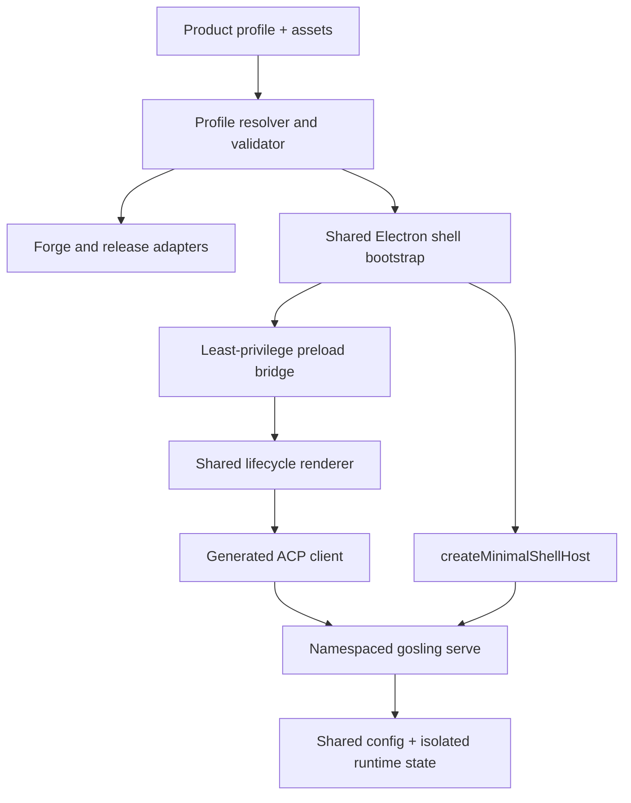
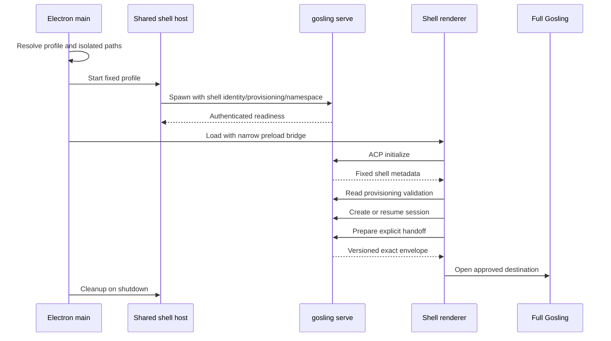

# Prototype execution plan — Gosling shared shell productization

Date: 2026-08-12
Baseline: `main` at merge commit `8627dc31a` (PR #46)
Target: Rust/ACP core + Electron/React Desktop + GitHub Actions release infrastructure
Profile: existing-repository/Giles; prototype-sized scope with production-grade discipline
Execution authority: plan only; implementation requires a dedicated branch/worktree
Recommended implementation branch: `codex/shell-productization`
Recommended commit policy: one local commit per accepted gate; push and merge only when explicitly authorized

## 1. Mission

Turn the merged Gosling shell foundation into a reusable, packaged, tested, diagnosable, and releasable Electron shell host that a domain shell can consume without copying Gosling's Desktop main process, configuration authority, session engine, or release machinery.

The product of this plan is shared infrastructure. It is not DAWES, Project ABC, a `math_mcp` shell, a Physics/CST shell, or any other domain product. A deliberately neutral, non-publishable fixture shell is used only to prove the shared infrastructure end to end.

The primary acceptance workflow is:

1. resolve and validate a source-controlled, secret-free shell product profile;
2. build a neutral fixture shell with distinct application identity and embedded Gosling binary;
3. launch the packaged Electron application through the shared shell bootstrap;
4. establish authenticated ACP with the namespaced `gosling serve` child;
5. read and validate server-fixed provisioning before durable session creation;
6. create a session and prove selected extensions, tools, skills, and policy are enforced;
7. expose actionable runtime/compatibility/credential errors and a redacted diagnostic export;
8. restart and resume without crossing into main Gosling or another namespace;
9. hand off explicitly to full Gosling without silently widening authority;
10. exit without orphaning Electron or backend processes; and
11. build the same profile through reusable, identity-safe release workflows.

## 2. Binding scope

### 2.1 In scope

- A declarative, versioned shell **product profile** distinct from the existing runtime provisioning document.
- A reusable Electron main-process bootstrap around `createMinimalShellHost`.
- A least-privilege shell preload bridge and typed renderer lifecycle client.
- Shared renderer state and presentation for startup, readiness, degraded, offline, relink, incompatibility, policy denial, diagnostics, and handoff states.
- A neutral test renderer/fixture shell that proves the shared host without becoming a domain shell.
- Packaged Electron renderer-to-backend smoke tests.
- Build-time package identity and distribution-asset resolution for macOS, Windows, Linux, and Flatpak.
- Reusable shell bundle/release workflows with collision-proof artifact naming and publish safeguards.
- Installed-application coexistence and namespace-isolation validation.
- Core/profile/provisioning/handoff compatibility checks and an explicit upgrade policy.
- Integration of the existing verified V8 archive helper into clean Linux CI after diagnosis.
- Redacted diagnostics and operator troubleshooting guidance.
- Security, recovery, accessibility, dependency, release, and documentation audits.

### 2.2 Explicitly out of scope

- Any named or domain-specific shell product.
- Domain adapter semantics, native domain payloads, domain actions, domain resources, prompts, workflows, or domain UI.
- Product branding or final shell artwork; only the input contract and validation are implemented.
- Publishing a real shell release or enabling an updater feed.
- Changing Gosling's authority model from `inherit`/optional `restricted`.
- Moving protected credential values into a shell profile or provisioning document.
- Creating a second settings, provider, extension, skill, session, or credential authority.
- Generalizing the shell host into an arbitrary-process launcher.
- Broad refactoring of the existing 3,399-line `ui/desktop/src/main.ts`; shared shell logic must be extracted into new modules and must not enlarge that orchestrator.
- Silent cross-version compatibility or automatic session migration without an explicit, tested contract.
- Repairing unrelated release-readiness or Desktop backlog items.

### 2.3 Scope-pressure policy

If delivery pressure appears, cut in this order:

1. convenience scaffolding/generator commands;
2. optional visual design-system components beyond required states;
3. optional additional Linux package formats in PR smoke CI;
4. optional external release-repository support beyond a documented seam;
5. performance optimization beyond startup/leak correctness.

Never cut authenticated ACP, server-fixed identity, provisioning validation, policy enforcement, profile validation, application identity isolation, packaged smoke coverage, process cleanup, redaction, compatibility failure, or publish safeguards.

## 3. Existing foundation and constraints

### 3.1 Verified baseline from PR #46

The implementation begins from these existing surfaces and must extend rather than duplicate them:

- `crates/gosling-sdk-types/src/shell.rs`: shell identity, provisioning, policy, domain adapter, and handoff DTOs.
- `crates/gosling/src/acp/shell.rs`: server-fixed runtime shell state.
- `crates/gosling/src/acp/shell_validation.rs`: structured provisioning validation.
- `crates/gosling/src/acp/server/shell_handlers.rs`: read/validate/domain/handoff handlers and server-side policy denial.
- `crates/gosling-cli/tests/shell_provisioning_validation_test.rs`: CLI preflight coverage.
- `crates/gosling-cli/tests/shell_runtime_e2e_test.rs`: spawned authenticated runtime, isolation, restart, skill/extension/tool/policy coverage.
- `ui/desktop/src/goslingServe.ts`: managed child process, TLS/readiness, startup diagnostics, packaged binary lookup, and cleanup.
- `ui/desktop/src/shellHost.ts`: `createMinimalShellHost` and secure baseline `BrowserWindow` options.
- `ui/desktop/src/components/shell/{ShellFrame,ShellStatus}.tsx`: initial common presentation primitives.
- `ui/desktop/forge.config.ts`: current environment-based product/executable/protocol/package identity composition.
- `scripts/with-rusty-v8-cache.sh`: verified V8 archive acquisition/cache wrapper with target/profile detection, trusted checksums, locking, and archive validation.

PR #46 validation established that the Rust workspace, Clippy, generated ACP/SDK contracts, Desktop typecheck/tests, provisioning tests, and spawned runtime path pass locally. Gate 0 live readback found historical native `rusty_v8` failures but also a current merged-main run that reached tests and failed unrelated replay data. The CI job still invokes Cargo directly and therefore does not deterministically provide the native archive independent of restored Cargo state.

### 3.2 Architectural invariants

1. **Server-fixed identity.** The renderer cannot assert or widen shell identity, namespace, provisioning, policy, or authority through RPC parameters.
2. **One Gosling core.** Shells reuse the Gosling runtime; they do not fork agent/session/provider behavior.
3. **Gosling remains configuration authority.** Shell profiles contain references and packaging metadata, never credential values or replacement provider/settings stores.
4. **Shared config, isolated state.** Protected credential/config catalogs remain intentionally shared; shell runtime data/state/session/cache surfaces remain namespace-isolated.
5. **Server-side enforcement.** UI hiding is not a security boundary. Denied ACP methods and provisioned capabilities are enforced in Rust before dispatch/session use.
6. **Explicit handoff.** A shell cannot silently widen itself. Full Gosling handoff uses the versioned server-prepared envelope and exact references.
7. **No parallel schema authority.** Canonical Rust shell DTOs generate ACP/TypeScript contracts. Product-profile schema is build/host configuration, not an alternate runtime provisioning schema.
8. **Orchestrators stay thin.** `main.ts`, Forge config, and workflow entry files may route/compose; lifecycle, validation, naming, release, and diagnostic rules live in focused modules/scripts.
9. **Fail before persistence.** Invalid product profiles and provisioning fail before packaging or durable session creation respectively.
10. **No mock success.** A build artifact, readiness state, diagnostic export, updater state, or release result is never reported successful without observing the underlying operation.
11. **Exact product identity.** Executable, bundle/package ID, protocol, updater channel, user data, single-instance behavior, process registry, diagnostics, and artifact names derive from one resolved profile.
12. **Evidence-bound acceptance.** P0/P1 requirements become `verified` only with observed command or installed-artifact evidence for the exact revision.

### 3.3 Checkable invariant registry

These are intent definitions, not claims that the current/future implementation already conforms. Gate-specific tests and the final architecture audit must evaluate them.

| ID | Checkable statement | Enforcement/evidence source | Severity |
| --- | --- | --- | --- |
| SHP-INV-001 | Every shell process receives identity, provisioning, and namespace only from the resolved main-process profile and fixed server arguments; renderer/ACP session inputs expose no override | preload/IPC type search; CLI argument construction test; runtime identity mismatch test | critical |
| SHP-INV-002 | Every product profile and provisioning document is secret-free; every credential value stays behind Gosling's protected credential authority | strict schema/secret-shape validation; sentinel scan of manifests, logs, diagnostics, session metadata | critical |
| SHP-INV-003 | Every shell custom-method denial occurs in Rust before dispatch and cannot be changed by renderer state | existing policy handler test plus packaged denied-method probe | critical |
| SHP-INV-004 | Every shell package identity field and artifact name is a pure function of one canonical resolved profile/hash | resolver golden tests; package readback; no direct shell identity environment reads outside resolver adapter | high |
| SHP-INV-005 | Every renderer-accessible shell operation belongs to the explicit shell IPC allowlist and is validated/size-bounded in main | preload surface snapshot; channel registration reverse trace; malformed/oversized IPC tests | critical |
| SHP-INV-006 | Every backend process has one lifecycle owner and reaches a terminal cleaned state after normal or abnormal application termination | lifecycle transition tests; PID/process-registry packaged evidence | critical |
| SHP-INV-007 | Full Gosling and each shell use distinct application/runtime state roots while sharing only the documented protected configuration roots | resolved path matrix; three-app sentinel/coexistence test | critical |
| SHP-INV-008 | No domain payload, action semantics, workflow, prompt, or branding enters shared host modules or neutral fixtures | import/content/reverse-trace audit; module contracts | high |
| SHP-INV-009 | No fixture, unsigned artifact, or non-publishable profile can reach signing, updater, or release upload steps through workflow inputs | profile rule; workflow condition tests/dry run; permission audit | critical |
| SHP-INV-010 | No session is created until profile, core/method/schema compatibility, fixed identity, and provisioning validation pass | ACP call-order integration test; failed-preflight empty-session assertion | critical |
| SHP-INV-011 | Every diagnostic field is allowlisted and bounded; credential/server-secret/content sentinels never appear in exported bundles | diagnostic schema/sentinel/size/permission tests | critical |
| SHP-INV-012 | Every P0/P1 requirement marked verified links to evidence produced from the same final revision | traceability/evidence freshness check at Gate 8 | high |

Any unavoidable violation requires an explicit, expiring exception request and operator approval; none is planned.

### 3.4 Capability and intent map

```text
Gosling focused clients
├── Safe runtime composition
│   ├── fixed identity and provisioning (existing foundation)
│   ├── shared Electron bootstrap and narrow preload
│   ├── authenticated ACP compatibility and lifecycle
│   └── explicit handoff and diagnostics
├── Product isolation
│   ├── declarative profile and canonical identity
│   ├── application/runtime path and protocol separation
│   └── packaged coexistence proof
└── Reproducible distribution
    ├── trusted Linux build prerequisite
    ├── profile-driven cross-platform packages
    ├── artifact readback/checksums/provenance
    └── guarded signing, publishing, updating, and rollback
```

A proposed implementation that maps to none of these capabilities is scope drift and must be removed or added through change control.

## 4. Requirements and acceptance summary

The complete matrix is in [`traceability-matrix.md`](traceability-matrix.md). Stable IDs are reserved now and must not be renumbered.

### P0 — primary workflow

- **SHP-REQ-001 — Product profile contract.** One versioned, secret-free profile resolves every shared runtime/build/distribution identity field and rejects unknown schema versions, unsafe paths, duplicate/colliding identities, and incomplete publishable profiles.
- **SHP-REQ-002 — Profile/provisioning separation.** Build/packaging metadata cannot override server provisioning; the profile may only reference the provisioning file and declare compatibility.
- **SHP-REQ-003 — Shared Electron bootstrap.** A production entrypoint calls `createMinimalShellHost`, starts the embedded backend, creates the secure window, waits for readiness, loads the shell renderer, and owns cleanup.
- **SHP-REQ-004 — Least-privilege preload.** The shell renderer receives only typed shell lifecycle/diagnostic/handoff operations and never inherits the full Desktop filesystem/settings IPC surface by default.
- **SHP-REQ-005 — Renderer lifecycle.** Shared state deterministically represents booting, validating, ready, busy, degraded, relink-required, incompatible, offline, stopping, and fatal states with actionable recovery.
- **SHP-REQ-006 — Authenticated ACP path.** The packaged renderer establishes authenticated ACP to the child, verifies server-fixed shell identity, reads validation, and creates/resumes sessions through the existing generated SDK.
- **SHP-REQ-007 — Runtime policy proof.** Packaged acceptance proves extension/tool/skill selection and denied methods are enforced by the backend, not renderer affordances.
- **SHP-REQ-008 — Process lifecycle.** Normal quit, window close, startup failure, renderer crash, backend early exit, and forced termination produce bounded cleanup and no orphan backend.
- **SHP-REQ-009 — Application identity isolation.** Full Gosling and two fixture identities can coexist without sharing protocol, user data, cache, logs, process registry, single-instance lock, updater channel, or shell runtime state.
- **SHP-REQ-010 — Compatibility fail-closed.** Embedded core, product profile, provisioning schema, shell ACP methods, and handoff envelope are checked before session use; unsupported combinations fail with deterministic diagnostics.
- **SHP-REQ-011 — Packaged smoke.** At least one actual packaged artifact exercises renderer → preload → Electron main → child backend → authenticated ACP → session → restart → cleanup.
- **SHP-REQ-012 — Build identity integrity.** Resolved profile identity is used consistently by Forge, bundled resources, protocol registration, executable/package naming, updater metadata, and artifact naming.
- **SHP-REQ-013 — Release workflow.** Reusable workflows build unsigned test artifacts and optionally signed release artifacts from a validated source-controlled profile, with checksums/provenance and no cross-profile publishing.
- **SHP-REQ-014 — Linux CI V8 repair.** A clean Linux runner provides the exact verified `rusty_v8` archive through the existing helper, invalidates stale caches correctly, and reaches the Rust test suite.
- **SHP-REQ-015 — Redacted diagnostics.** Startup/runtime/package/compatibility diagnostics are actionable, bounded, owner-private where applicable, and exclude server secrets and credential values.
- **SHP-REQ-016 — Explicit handoff.** The shared UI requests the server-prepared handoff envelope, validates destination/protocol, opens full Gosling explicitly, and never carries implicit expanded authority.
- **SHP-REQ-017 — Neutral fixture only.** Test-only fixtures are unmistakably non-publishable and contain no domain semantics, branding claim, or production updater destination.
- **SHP-REQ-018 — Security baseline.** Context isolation, sandboxing, CSP, navigation/window-open restrictions, loopback pinning/authentication, path validation, secret redaction, and dependency checks pass.

### P1 — committed supportability and release behavior

- **SHP-REQ-019 — Distribution asset contract.** Build validation reports every required icon/installer/update asset by target and rejects missing or mismatched publishable assets.
- **SHP-REQ-020 — Cross-platform package matrix.** Profile resolution and artifact identity are tested on macOS ARM/x64, Windows x64, and Linux x64 package paths; release gates declare any intentionally unsupported target.
- **SHP-REQ-021 — Updater isolation.** Update manifests, channels, repository/feed, and enablement are profile-specific; fixture and unsigned builds cannot update or publish.
- **SHP-REQ-022 — Reproducible build manifest.** Every artifact embeds a redacted resolved profile, Gosling/core revision, schema versions, target/arch, and profile hash for support/readback.
- **SHP-REQ-023 — Developer workflow.** A documented check/build/package/smoke workflow can validate a new profile without editing Forge or workflow source.
- **SHP-REQ-024 — Diagnostics export UX.** A user can save a redacted diagnostic bundle after startup or runtime failure without exposing arbitrary filesystem access to the renderer.
- **SHP-REQ-025 — Accessibility and resilience.** Shared shell states are keyboard reachable, screen-reader labeled, contrast-safe, and usable at minimum window size without hidden recovery actions.
- **SHP-REQ-026 — Observed coexistence matrix.** Installed-artifact tests cover full Gosling plus at least two fixture profile identities, deep links, concurrent launch, quit, restart, and independent state.
- **SHP-REQ-027 — Documentation and handoff.** Architecture, profile reference, extension recipe, troubleshooting, release runbook, evidence, and continuation state match implementation.
- **SHP-REQ-028 — Rollback.** Release/profile changes document rollback to the prior artifact/profile schema and prove failed upgrades do not mutate unrelated shell or full-Gosling state.
- **SHP-REQ-029 — Quality gate.** Rust format/test/Clippy, schema generation, SDK build/tests/typecheck, Desktop lint/typecheck/tests, profile checks, packaged smoke, and workflow validation are green at final acceptance except explicitly human-only signing gates.

### P2 — stretch after all P0/P1 verification

- **SHP-REQ-030 — Scaffold command.** Generate a profile skeleton and asset checklist without generating domain behavior or secrets.
- **SHP-REQ-031 — Additional common UI primitives.** Add optional history/session selector and diagnostic detail components only when at least two real consumers prove the abstraction.
- **SHP-REQ-032 — External release destination adapter.** Support a separately authorized release repository without broadening default workflow permissions.

## 5. Proposed architecture

Paths below are implementation targets, not claims that the files already exist. Gate 0 must reconfirm ownership and adjust paths through a recorded plan change if current `main` has moved.

### 5.1 Layering



Dependency direction is profile parser → application lifecycle → platform adapters. Renderer code does not import Electron main APIs, Forge config, Node filesystem, or backend process primitives. Packaging scripts do not implement runtime policy. Rust remains authority for provisioning and session behavior.

### 5.2 Runtime sequence



### 5.3 Module contracts

| Module | Responsibility | Must not own | Allowed dependencies |
| --- | --- | --- | --- |
| Product profile | Parse/version/validate product identity, asset references, compatibility, and publish policy | Provisioning semantics, credentials, runtime policy | Node stdlib, existing schema/validation utility |
| Build resolver | Produce deterministic environment/resource manifest and artifact names | Signing secrets, release publication, runtime ACP | Product profile, filesystem adapter |
| Shell bootstrap | Sequence app identity, backend start, window creation, readiness, renderer load, cleanup | Domain actions/UI, provider/session rules | Product profile, `shellHost`, Electron adapter |
| Shell lifecycle | Typed state machine and recovery actions | Electron APIs, filesystem, domain semantics | ACP shell client interface, clock where tested |
| Shell preload | Expose allowlisted lifecycle/diagnostic/handoff bridge | Generic file/settings IPC, raw secret, arbitrary IPC | Electron `contextBridge`, typed channels |
| Shell ACP client | Initialize, verify identity/compatibility, read provisioning, create/resume, handoff | Duplicate DTOs or policy decisions | Generated Gosling SDK only |
| Diagnostics | Aggregate bounded startup/runtime/build facts and write redacted bundle | Credential/server-secret values, arbitrary renderer paths | Existing startup diagnostics, safe main-process save adapter |
| Package adapter | Map resolved profile to Forge target fields and required assets | Runtime authority or mutable defaults | Product profile resolver, Forge |
| Release adapter | Validate profile/ref, call platform builders, name/check/attest artifacts | Domain shell code, unreviewed dynamic commands | Reusable workflows, package adapter outputs |
| Neutral fixture | Exercise extension seams and states | Product branding, production IDs/feed, domain behavior | Shared shell APIs only |

### 5.4 Product profile contract

The preferred initial format is JSON to keep Forge and CI parsing deterministic without adding a second YAML parser at bootstrap time. Gate 2 records an ADR after confirming existing build tooling. Minimum conceptual shape:

```json
{
  "schemaVersion": 1,
  "identity": {
    "id": "fixture-a",
    "displayName": "Gosling Shell Fixture A",
    "version": "0.0.0-test",
    "runtimeNamespace": "shell-fixture-a"
  },
  "runtime": {
    "provisioning": "fixtures/shell/provisioning.json",
    "compatibility": {
      "gosling": "=<embedded-version>",
      "provisioningSchema": 1,
      "handoffSchema": 1
    }
  },
  "package": {
    "executableName": "gosling-shell-fixture-a",
    "bundleId": "ai.gosling.fixture.a",
    "linuxPackageId": "ai.gosling.fixture.a",
    "protocolScheme": "gosling-fixture-a",
    "assetsRoot": "fixtures/shell/assets/a"
  },
  "updates": {
    "enabled": false,
    "channel": "fixture-disabled"
  },
  "distribution": {
    "publishable": false,
    "artifactPrefix": "gosling-shell-fixture-a"
  }
}
```

Validation rules:

- IDs, namespace, package IDs, executable name, protocol, artifact prefix, and update channel follow target-specific allowlists and length limits.
- Paths are repository-relative, canonicalized, non-symlink where trust requires it, and cannot escape approved profile/asset roots.
- Profile identity and the referenced provisioning identity must match exactly after `shell-validate` resolution.
- No keys named or shaped like secrets, tokens, passwords, API keys, or private key material are accepted.
- Unknown fields are rejected for build profiles until a compatibility policy explicitly permits them; runtime persisted formats continue their own forward-compatible rules.
- `publishable: false` is irreversible from workflow input/environment; only a reviewed profile change can permit publishing.
- Publishing requires complete target assets, unique identifiers, a non-fixture namespace, an approved release destination, signing policy, and updater policy.
- Profile resolution emits one canonical JSON representation and SHA-256 hash consumed by app, package, tests, and release jobs.

### 5.5 Proposed file plan

| Proposed path | Purpose | Expected size | Gate |
| --- | --- | ---: | ---: |
| `ui/desktop/src/shell/profile.ts` | typed product profile and resolved profile types | 180 | 2/3 |
| `ui/desktop/src/shell/profileValidation.ts` | schema, path, identity, collision, secret-shape validation | 350 | 3 |
| `ui/desktop/src/shell/appIdentity.ts` | derive/set userData, logs, registry, lock, protocol, updater identities | 250 | 3/6 |
| `ui/desktop/src/shell/bootstrap.ts` | shared startup/shutdown orchestrator | 350 | 4 |
| `ui/desktop/src/shell/lifecycle.ts` | deterministic lifecycle state machine | 300 | 4 |
| `ui/desktop/src/shell/acpClient.ts` | generated-SDK shell initialize/read/create/resume/handoff adapter | 300 | 4 |
| `ui/desktop/src/shell/compatibility.ts` | version/schema compatibility evaluation | 220 | 4 |
| `ui/desktop/src/shell/diagnostics.ts` | redacted bounded diagnostic aggregation/export service | 300 | 4/6 |
| `ui/desktop/src/shell/ipcChannels.ts` | shell-only IPC command/event types and validators | 150 | 4 |
| `ui/desktop/src/shell/preload.ts` | least-privilege shell bridge entrypoint | 180 | 4 |
| `ui/desktop/src/shell/renderer/ShellRuntimeProvider.tsx` | lifecycle/ACP state and recovery actions | 350 | 5 |
| `ui/desktop/src/shell/renderer/ShellHostApp.tsx` | shared state surfaces and domain slot boundary | 300 | 5 |
| `ui/desktop/src/components/shell/*` | additive status/error/relink/diagnostic/handoff components | ≤300 each | 5 |
| `ui/desktop/src/shell/fixture/*` | neutral non-publishable test renderer and profiles | ≤250 each | 3/5 |
| `ui/desktop/scripts/resolve-shell-profile.*` | CLI build resolver/check and canonical output | 350 | 3 |
| `ui/desktop/scripts/verify-shell-package.*` | installed artifact/profile/resource identity verification | 300 | 6 |
| `ui/desktop/forge.config.ts` | thin adapter to resolved profile | bounded edit | 3/7 |
| `ui/desktop/vite.*.config.mts` | select shared shell entries from resolved build mode | bounded edit | 4 |
| `ui/desktop/package.json` | check/package/smoke scripts only | bounded edit | 3/6 |
| `ui/desktop/tests/shell/*.test.ts(x)` | unit/integration tests by module | ≤700 each | 3–6 |
| `ui/desktop/e2e/shell-packaged.spec.ts` | packaged renderer/backend/restart/cleanup smoke | 500 | 6 |
| `fixtures/shell-products/` | two neutral profiles, provisioning, and test-only assets | fixture | 3/6 |
| `scripts/with-rusty-v8-cache.sh` | retain existing helper; change only if diagnosis proves defect | bounded | 1 |
| `.github/actions/resolve-shell-profile/` | optional composite wrapper for profile validation/output | 250 | 7 |
| `.github/workflows/bundle-shell.yml` | reusable profile-driven platform bundle orchestration | 350 | 7 |
| `.github/workflows/shell-package-smoke.yml` | PR/nightly fixture package and smoke | 250 | 6/7 |
| `.github/workflows/release-shell.yml` | guarded profile-driven publish/attestation workflow | 350 | 7 |
| `.github/workflows/ci.yml` | invoke existing V8 helper in Linux test job | bounded edit | 1 |
| `docs/architecture/shell-foundation.md` | landed shared productization architecture and limits | bounded edit | 8 |
| `docs/SHELL_PRODUCTS.md` | profile/build/package/extend/troubleshoot manual | 700 | 8 |
| `docs/adr/0007-shell-product-profile.md` | profile authority and schema decision | 180 | 2 |
| `docs/adr/0008-shell-host-process-boundary.md` | preload/bootstrap/process/identity decision | 220 | 2 |
| `docs/adr/0009-shell-release-isolation.md` | artifact/updater/publish identity decision | 220 | 2 |
| `docs/build/shell-productization/*` | living plan, ledgers, evidence, audits, handoff | ≤1200 each | all |

Gate 0 must inspect current main before accepting this file plan. If the main-process modularization campaign lands first, reuse its extracted lifecycle services rather than restoring logic to `main.ts`.

## 6. Execution strategy and dependency graph

### 6.1 Critical paths

**Path A — runtime host productization**

`profile contract → app identity → bootstrap/preload → ACP lifecycle → shared renderer states → packaged smoke → coexistence/security hardening`

**Path B — distribution productization**

`V8 clean CI → profile build resolver → package adapters/assets → platform workflows → artifact verification → guarded release workflow`

The paths join at packaged acceptance. Release work must not precede a real packaged fixture smoke, and renderer implementation must not proceed before the profile/identity and preload contracts are frozen.

Safe parallelism is deliberately limited:

- Gate 1 V8/CI repair may run independently from Gate 2 design after Gate 0 records the baseline, but it lands as a separate change.
- After Gate 2 freezes interfaces, Gate 3 profile/build work and isolated Gate 4 lifecycle test-harness preparation may proceed in separate files/worktrees; no lifecycle implementation consumes an unfrozen profile API.
- Gate 5 renderer component work may parallel Gate 4 only against frozen lifecycle/IPC interfaces and test doubles; integration waits for Gate 4.
- Gate 7 workflow design may begin after Gate 3, but package/release acceptance waits for Gate 6's real packaged smoke.
- No two workers edit Forge config, Vite entry configuration, package scripts, shared workflow files, or the same test fixture concurrently.

Estimated complexity is relative and assumes one experienced Gosling/Electron implementer plus review:

| Gate | Complexity | Primary cost driver |
| --- | --- | --- |
| 0 | S | repository/runtime reorientation and clean V8 reproduction |
| 1 | M | supply-chain-safe V8 integration and clean CI evidence |
| 2 | M | cross-process/profile/release contracts and threat model |
| 3 | L | platform-aware profile validation and Forge compatibility |
| 4 | XL | process lifecycle, narrow preload, real ACP, compatibility, diagnostics |
| 5 | L | complete shared state/recovery/accessibility UI |
| 6 | XL | packaged harness, restart, process cleanup, three-product coexistence |
| 7 | XL | four-platform package/release reuse, signing guards, artifact readback |
| 8 | L | multi-lens audit, full revalidation, docs, acceptance/handoff |

These are planning estimates, not schedule commitments. Gate 4, 6, or 7 evidence may require re-planning rather than compressing verification.

### 6.2 Gate overview

| Gate | Outcome | Blocking exit condition |
| --- | --- | --- |
| 0 | Reorientation and clean baseline | Current main, repo instructions, affected paths, tests, and existing user work verified |
| 1 | Linux V8 CI prerequisite | Clean Linux run reaches Rust tests using existing verified helper; no unsafe cache workaround |
| 2 | Architecture and contracts | ADRs, module contracts, profile schema, compatibility policy, threat model, and test design reviewed |
| 3 | Profile/build foundation | Two neutral profiles resolve deterministically; identities/assets/collisions/publish safeguards tested |
| 4 | Main/preload/backend lifecycle | Shared bootstrap and least-privilege bridge connect to real child/ACP and clean up all failure paths |
| 5 | Shared renderer and handoff | All common lifecycle/error/relink/diagnostic/handoff states work without domain semantics |
| 6 | Packaged smoke and coexistence | Actual package completes primary workflow, restart, isolation, and no-orphan checks |
| 7 | Cross-platform release machinery | Profile-driven artifacts build with unique identity; publish path is guarded, signed path ready but not invoked |
| 8 | Hardening, docs, final acceptance | Security/recovery/release audits closed; P0/P1 verified or formally re-scoped; handoff complete |

### 6.3 Gate decision protocol

At each gate exit, record exactly one decision in `build-state.md` and the gate audit:

- **GO:** every exit criterion and cumulative required check passes for the exact gate revision;
- **PATCH:** an in-scope defect remains; stay in the gate, patch, regression-test, and re-run;
- **REPLAN:** architecture, requirement, sequence, target support, or acceptance must change; write a plan-change record before further implementation;
- **BLOCKED:** an external credential, immutable source, platform, or operator decision is missing; preserve partial evidence and stop dependent work; or
- **STOP:** a critical invariant cannot be satisfied without crossing scope/authority; do not build around it.

A gate cannot be declared GO from static inspection alone when its exit criteria require runtime, package, platform, CI, signing, or release evidence. Later gates may begin in parallel only where Section 6.1 explicitly permits it and may not cause an earlier non-GO gate to be skipped.

## 7. Gate-by-gate implementation plan

### Gate 0 — Orientation, continuation, and baseline

**Purpose:** prevent implementation against stale assumptions or the completed PR branch.

**Actions**

1. Create a dedicated worktree from current `origin/main`; verify no uncommitted operator work is touched.
2. Re-read `AGENTS.md`, README, docs index, shell architecture, relevant ADRs, this plan package, release docs, and latest shell session record.
3. Verify PR #46 changes remain present and locate exact current symbols before editing.
4. Inventory existing Desktop lifecycle extraction work, package scripts, updater logic, deep-link handling, diagnostics, IPC validation, CSP, and Playwright harness.
5. Inventory platform workflow inputs/permissions/artifact conventions and validate workflow syntax tooling available.
6. Reproduce or retrieve direct Linux CI evidence and classify the exact V8 version/target/profile/cache state separately from unrelated test failures.
7. Confirm actual package targets to commit for first acceptance. Default: macOS arm64/x64, Windows x64, Linux x64; only one platform must execute installed smoke locally, while CI package/readback spans all supported targets.
8. Initialize `evidence/`, `audits/`, `defects.md`, and `handoff.md` in this namespaced plan directory; do not overwrite completed workspace campaign artifacts.
9. Update `build-state.md` with exact baseline SHA, worktree, commands, and next slice.

**Exit criteria**

- Clean dedicated worktree and baseline SHA recorded.
- Every proposed file path is confirmed or amended through `plan-changes.md`.
- V8 failure evidence is reproduced or retrieved and classified as helper integration, helper defect, upstream asset, network, or stale Cargo cache; unrelated current CI failures remain separately attributed.
- No code changes beyond optional test/reproduction harness.

**Validation/evidence**

- `git status --short --branch`
- `git rev-parse HEAD && git log -1 --oneline`
- targeted symbol/path inventory
- clean-run V8 transcript with environment and archive path redacted only where necessary

**Audit lens:** architecture boundary and preservation of user work.

### Gate 1 — Repair the Linux V8 prerequisite

**Purpose:** restore trustworthy main/PR Rust test signal before shell packaging multiplies CI paths.

**Implementation slices**

1. Add focused tests for `scripts/with-rusty-v8-cache.sh` if target/profile/version/checksum/cache-invalidity cases are not already covered. Tests use fake archives/download fixtures where possible; they must not depend on a live GitHub download for unit behavior.
2. Confirm `vendor/v8/Cargo.toml` version resolution and trusted checksum table match `Cargo.lock` (`v8-goose 145.0.2` at planning baseline). The observed helper currently keys checksums on its vendored manifest version; reconcile any mismatch deliberately rather than weakening verification.
3. Run helper `--prepare` on a clean Linux target and verify archive shape, checksum, cache location outside Cargo `target/`, and `RUSTY_V8_ARCHIVE` propagation.
4. Change the CI Rust test job to execute its existing Cargo commands through `scripts/with-rusty-v8-cache.sh`, or prepare once and export the returned path for all three commands. Prefer one verified archive preparation and explicit env propagation.
5. Include helper version/target/profile/checksum inputs in cache keys or keep the helper's independent cache directory in an explicit Actions cache. Never rely on stale `target/**/gn_out` state from `rust-cache`.
6. Exercise cache miss, valid hit, corrupt archive, checksum mismatch, wrong target, lock contention, and network failure. A failure must be actionable and fail closed.
7. Compare a clean main run and PR run; confirm explicit helper evidence and that the job reaches tests. Attribute any later test failure separately rather than misclassifying it as V8.

**Stop conditions**

- If no trusted checksum exists for the exact version/target, stop and add it from an immutable upstream release source with human review; do not bypass checksum verification.
- If the upstream asset is unavailable, use an operator-provided verified seed artifact or build-from-source lane; do not commit a binary archive to git.
- If the helper itself selects the wrong version/profile, fix and regression-test it before CI wiring.

**Exit criteria**

- Two clean Linux runs (one cold cache, one warm cache) reach and execute the Rust test suite.
- Corrupt/wrong archives are rejected.
- No `curl | sh`, unverified download, broad write permission, or test skip is introduced.
- Existing format/MSRV/Clippy/schema jobs remain green.

**Audit lens:** supply-chain integrity and reproducible CI.

### Gate 2 — Freeze product, compatibility, security, and module contracts

**Purpose:** decide load-bearing contracts before UI or workflow code.

**Actions**

1. Write ADR-0007 for profile format, authority, versioning, strictness, canonicalization, hash, path rules, and relationship to provisioning.
2. Write ADR-0008 for main/preload/renderer process boundaries, lifecycle state machine, backend ownership, single-instance behavior, and shared/domain renderer seam.
3. Write ADR-0009 for package/update/artifact/release identity, fixture non-publishability, signing boundary, and coexistence.
4. Define exact profile JSON Schema/types and compatibility result taxonomy.
5. Decide bundled-core policy. Recommended prototype policy: every shell bundles the exact tested Gosling binary; profile compatibility pins the core version/revision; no external-core discovery.
6. Define ACP compatibility discovery. First inspect initialization/provisioning responses. Add additive version metadata only if current responses cannot prove core/method/schema compatibility.
7. Define lifecycle state/event table with legal transitions, retry behavior, terminal states, and user actions.
8. Define error taxonomy: profile/build error, provisioning/reference error, credential relink, compatibility error, environment/startup error, policy denial, transport loss, backend crash, package integrity error, and internal bug.
9. Threat-model untrusted profile path, deep link, renderer content, IPC payload, loopback endpoint, server secret, diagnostic logs, release inputs, artifact names, updater metadata, and signing secrets.
10. Define test fixture A and B identities. Both must be non-publishable and differ in every isolation-sensitive identifier.
11. Update traceability design refs and record any requirement change before implementation.

**Exit criteria**

- Every P0/P1 requirement maps to a module, file, automated test, and acceptance check.
- No renderer API can provide shell identity, provisioning path, namespace, filesystem path, updater feed, or release destination.
- Lifecycle and compatibility behavior are deterministic on paper.
- Profile cannot carry secrets or turn a fixture into a publishable product through environment inputs.

**Audit lens:** architecture invariants plus appsec/threat model.

### Gate 3 — Product-profile and build-resolution foundation

**Purpose:** create one authoritative input to all package/runtime identities before launching Electron.

**Implementation slices**

1. Implement parser and strict schema-version validation.
2. Implement repository-relative path canonicalization and approved-root containment.
3. Implement identity validators for shell ID, namespace, protocol, executable, macOS bundle, Windows/package identity, Linux package/Flatpak ID, update channel, and artifact prefix.
4. Implement secret-shaped key/value rejection and safe diagnostic rendering.
5. Implement compatibility field parser without yet performing runtime ACP checks.
6. Implement asset inventory by platform and publishability level.
7. Implement deterministic canonical JSON/hash output and generated build manifest in an ignored build directory.
8. Implement collision checker across all source-controlled profiles.
9. Add neutral fixture profiles A/B and test-only assets. Mark them `publishable: false`, version `0.0.0-test`, disabled updater, and fixture-only IDs.
10. Refactor Forge config into a thin consumer of the resolved profile while retaining default Gosling behavior when no shell profile is selected.
11. Add package scripts such as `shell:check-profile`, `shell:resolve-profile`, and `shell:package-fixture`; exact names follow existing script conventions.
12. Add CI profile-schema/collision checks triggered by profile, Forge, package, or shell-host changes.

**Acceptance tests**

- golden resolution for default Gosling and both fixture profiles;
- unknown schema/field, invalid ID/character/length, path traversal, symlink escape, missing provisioning, identity mismatch, missing asset, secret-shaped input, update/publish contradiction, duplicate namespace/protocol/package/artifact, and environment-override attempts;
- repeated resolution produces byte-identical canonical output/hash;
- default Gosling package configuration remains unchanged without profile input.

**Exit criteria**

- A new valid non-domain profile can be checked without editing Forge source.
- Invalid profile exits nonzero before Electron/Forge starts and produces field-addressed errors without secrets.
- Fixture publishing is mechanically impossible through normal workflow inputs.
- Desktop typecheck/unit tests and Forge configuration load pass.

**Audit lens:** configuration centralization, path safety, release identity, backward compatibility.

### Gate 4 — Shared Electron bootstrap, preload, ACP, compatibility, and diagnostics

**Purpose:** build the real process boundary and primary non-domain workflow.

**Implementation slices**

1. Implement `appIdentity` and set all app paths/identity before Electron readiness or lock acquisition. Preserve intentional shared Gosling config only inside backend runtime path construction.
2. Implement shell bootstrap with injected adapters for app/window/protocol/clock/process where tests require them.
3. Call `createMinimalShellHost` with resolved fixed profile, generated server secret, effective working directory, isolated diagnostics directory, isolated process registry, and packaged resource path.
4. Add shell-specific Vite main/preload/renderer entries rather than branching the full Desktop `main.ts` at runtime.
5. Implement narrow validated IPC channels for runtime snapshot, retry, stop, diagnostics export, and handoff/open action.
6. Implement ACP client using generated SDK/types only. Verify initialization shell metadata equals the resolved fixed profile.
7. Read provisioning/validation before new session; map validation issues to typed common states.
8. Implement compatibility evaluator before session use. Unknown newer schemas/method versions fail closed with minimum/actual details.
9. Implement new/resume session seam. The neutral fixture may create a session and issue deterministic read-only probes; it must not contain domain behavior.
10. Implement lifecycle reducer and reject illegal/stale transitions. Retry allocates a fresh child/secret after full cleanup.
11. Subscribe to backend exit/transport loss and distinguish expected stop from crash.
12. Extend existing startup diagnostics rather than duplicating log collection. Add bounded redaction for server secret, auth query/header values, credential-shaped data, home paths where required, and profile contents.
13. Implement safe main-process diagnostic export through an explicit save dialog/path, atomic write, restrictive permissions, size ceiling, and user warning.
14. Implement explicit handoff adapter around the existing server-prepared envelope and target protocol validation.
15. Keep `main.ts` changes limited to routing/import registration if any; no shell domain/lifecycle rules enter it.

**Failure-path tests**

- invalid profile and provisioning before persistence;
- backend binary absent/non-executable;
- readiness timeout and bad TLS fingerprint;
- identity mismatch;
- incompatible core/schema/method;
- relink-required credential profile;
- backend exits before/after ready;
- renderer reload/crash;
- ACP disconnect/reconnect;
- double retry and stale event;
- quit during startup;
- failed diagnostics write;
- malformed/oversized IPC and handoff URI;
- cleanup escalation after graceful timeout.

**Exit criteria**

- Headless/integration harness runs main → child backend → authenticated ACP → provisioning read → session creation/resume → cleanup using fixture A.
- Shell preload exposes no generic Desktop filesystem/settings/provider management APIs.
- Every failure reaches a typed, actionable state and retained redacted diagnostics.
- No failed preflight creates a durable session.
- No process remains after each automated lifecycle test.

**Audit lens:** process lifecycle/recovery plus preload/IPC security.

### Gate 5 — Shared renderer states, diagnostics, relink, and handoff UI

**Purpose:** make the common workflow operable without embedding domain behavior.

**Implementation slices**

1. Implement `ShellRuntimeProvider` over the lifecycle client with one state source and abort-safe effects.
2. Implement `ShellHostApp` layout with a typed domain-content slot that is mounted only in `ready`/allowed states.
3. Extend `ShellFrame`/`ShellStatus` or add focused components for booting, validation error, missing/relink credential, incompatibility, offline/retry, fatal, diagnostic export, and explicit handoff.
4. Display server-fixed shell name/version/namespace from verified runtime metadata, not renderer props alone.
5. Render provisioning issues with stable field/code/message and remediation action. Never display secrets or full private paths by default.
6. Provide relink/manage-credentials handoff to full Gosling rather than cloning credential management into the shell.
7. Implement explicit handoff confirmation summarizing question, requested capability, mutation intent, exact reference count, and return destination.
8. Add keyboard order, focus restoration, live-region status, accessible labels, minimum-size layout, reduced-motion behavior, and non-color-only status signals.
9. Add neutral fixture controls only for acceptance probes; label them test-only and exclude from publishable builds.

**Acceptance tests**

- lifecycle reducer/component matrix for every state and legal action;
- no ready/domain content before verified provisioning/compatibility;
- retry deduplication and stale result suppression;
- relink and handoff routes use exact server result;
- redaction snapshots/sentinel searches;
- keyboard/focus/ARIA/minimum-window tests;
- renderer cannot call undeclared IPC channels.

**Exit criteria**

- A user can understand and recover from every common non-domain failure without opening developer tools.
- Handoff is explicit and authority-preserving.
- Shared UI contains no domain copy, action, payload interpretation, or product branding.
- Desktop unit/typecheck/lint/format checks pass.

**Audit lens:** workflow/GUI/accessibility plus fake-success review.

### Gate 6 — Actual packaged smoke, restart, and coexistence

**Purpose:** close the largest known gap: source/unit tests do not prove packaged resources, CSP, preload, binary lookup, identity, or cleanup.

**Harness design**

- Package fixture A with the real embedded Gosling binary and test provisioning.
- Launch it as an installed/unpacked artifact through Electron, not `electron-forge start`.
- Use a test-only external controller via Playwright/Electron or a bounded automation harness. Do not enable a production remote-debug port.
- Use isolated temp HOME/config/data/state and deterministic fixture extension/skill directories.
- Record PIDs, runtime paths, profile hash, session IDs, and redacted diagnostics as evidence.

**Primary packaged scenario**

1. verify artifact name, executable, embedded manifest/hash, bundled binary, provisioning, icons/resources, package ID, and protocol metadata;
2. launch fixture A and observe booting → ready;
3. read displayed fixed identity and compare to ACP initialization/profile;
4. create a session in the profile namespace;
5. prove selected skill loads and disallowed skill/tool does not;
6. call a denied custom method and observe server policy denial;
7. close and relaunch the application;
8. resume/read the prior shell session;
9. request and inspect a redacted diagnostics bundle;
10. execute an explicit non-mutating handoff fixture or validate the prepared envelope without launching a production target;
11. quit and verify Electron/backend PIDs and process registry are clear.

**Negative packaged scenarios**

- bad provisioning reference;
- incompatible profile/core metadata;
- missing embedded binary;
- backend crash after ready;
- protocol/deep-link malformed input;
- CSP rejects non-loopback/non-allowlisted connection;
- diagnostic sentinels are absent;
- fixture updater and publish path disabled.

**Coexistence matrix**

Run default Gosling, fixture A, and fixture B with isolated app identities while intentionally sharing only the approved config/credential test authority. Verify:

- concurrent launch succeeds;
- each single-instance lock affects only itself;
- each protocol opens only its owner;
- session lists/state/cache/logs/registry/window state do not cross;
- quitting/updating/restarting one does not signal another;
- main Gosling cannot see fixture sessions through its default runtime namespace;
- fixtures cannot access each other's runtime namespace;
- no raw credential is copied into fixture roots.

**Exit criteria**

- Packaged primary scenario passes twice from clean state and once across restart.
- Coexistence matrix passes with no orphan processes or cross-identity files.
- Package verifier detects deliberate resource/identity tampering.
- Evidence identifies exact artifact hash and revision.

**Audit lens:** installed workflow, process/resource leaks, CSP/deep-link security, data isolation.

### Gate 7 — Cross-platform packaging and guarded release workflows

**Purpose:** make shell artifacts reproducible and releasable without allowing profile/input drift or accidental publication.

**Implementation slices**

1. Extract shared profile resolution into a composite action or audited script used identically by every platform workflow.
2. Add `profile` input to a new shell bundle workflow; accept only a repository-relative source-controlled profile path at the checked-out ref.
3. Resolve profile once, verify clean tree/ref, emit canonical manifest/hash and sanitized outputs, then pass explicit outputs to platform jobs. Never interpolate unchecked profile strings into shell commands.
4. Reuse existing macOS ARM/x64, Linux, and Windows bundle internals where practical; do not fork four copies of package logic.
5. Parameterize product name, executable, bundle/package IDs, protocol, asset root, artifact prefix, update config, and package metadata from resolved outputs.
6. Enforce required target asset matrix before each platform build.
7. Include embedded binary/version/profile/revision readback after packaging.
8. Name artifacts `<artifact-prefix>-<version>-<os>-<arch>.<ext>` and reject collisions before upload.
9. Generate checksums and provenance attestations for exact artifacts and embedded profile manifest.
10. Add unsigned fixture package/smoke workflow for PR/manual/nightly use. Never upload fixtures to a public release.
11. Add guarded release workflow that requires `publishable: true`, immutable tag/ref, matching version, approved environment, complete signing inputs, allowed destination, successful packaged smoke, and human maintainer invocation/approval.
12. Keep signing secrets only in GitHub environments; never emit them as outputs or profile values.
13. Keep updater disabled until a compatible signed predecessor and profile-specific manifest are verified. Release workflow must not flip this through an input.
14. Add workflow static validation and permission review. Default `contents: read`; grant write/id-token/attestations only to final publish/attestation jobs.
15. Add rollback procedure: preserve prior artifact/update manifest, avoid overwriting stable until readback, and document how to withdraw a bad profile version without changing unrelated products.

**Cross-platform checks**

- macOS bundle ID, executable, protocol, icon, entitlements, signing/notarization readback;
- Windows executable/product identity, protocol, icon, signature, installer metadata readback;
- Linux deb/rpm/Flatpak ID, executable, desktop file/protocol/icon/dependency metadata readback;
- all targets contain correct core/profile/revision and no fixture/publisher contamination;
- updater metadata points only to the profile channel/destination or is absent when disabled.

**Exit criteria**

- Unsigned fixture artifacts build and pass structural verification on every committed target.
- At least one platform runs full packaged smoke; others run launch smoke where CI supports it and structural readback otherwise, with limitations explicit.
- Release dry run reaches the publish gate but cannot publish fixture artifacts.
- Workflow permissions and injection resistance are audited.
- No real release, signing, or updater enablement occurs during this plan without separate approval.

**Audit lens:** release engineering, supply chain, workflow permissions, artifact identity.

### Gate 8 — Hardening, documentation, acceptance, and handoff

**Purpose:** close defects, freeze truthful docs, and leave a resumable implementation.

**Hardening sweep**

1. Reverse-trace every significant new file to a requirement; remove or record scope drift.
2. Audit module boundaries, duplicate schemas, global mutable state, race/stale events, process cleanup, path/IPC/deep-link validation, diagnostic redaction, updater isolation, workflow injection, signing permissions, and artifact collisions.
3. Run dependency/license/vulnerability checks for any new dependency. Prefer no new dependency for profile parsing if existing stack suffices.
4. Search for TODO/FIXME/placeholder/mock/success-without-operation and disposition each finding in `defects.md`.
5. Re-run cold/warm V8 CI, all unit/integration tests, packaged smoke, coexistence, and release dry run from the final revision.
6. Run clean-checkout quickstart for adding/checking/packaging a neutral profile exactly as documented.
7. Update shell architecture, product manual, troubleshooting, release checklist, docs index, TODO, ADR index, traceability, risk/assumption ledgers, evidence index, and handoff.
8. Record platform/signing tests that require human/credential access as explicit maintainer gates; do not mark them verified without observed evidence.

**Final validation command families**

Exact commands are reconfirmed at Gate 0 and recorded verbatim in evidence. Expected minimum:

```bash
cargo fmt --all -- --check
cargo test --workspace
cargo clippy --workspace --all-targets -- -D warnings
source bin/activate-hermit
just check-acp-schema
pnpm install --frozen-lockfile --ignore-scripts
pnpm --filter @repo-makeover/gosling-sdk run build
pnpm --filter @repo-makeover/gosling-sdk test
cd ui/desktop
pnpm run typecheck
pnpm run lint:check
pnpm run format:check
pnpm run test:run
pnpm run shell:check-profiles
pnpm run shell:package-fixture
pnpm run shell:test-packaged
```

Also run workflow syntax/action pin checks, package readback scripts, checksum verification, and platform-specific signing checks where credentials exist.

**Exit criteria**

- Every P0/P1 requirement is `verified` with exact evidence or explicitly re-scoped through a plan-change record accepted by the operator.
- No unexplained red CI check, including Linux Rust build/test.
- No open critical/high security, data-loss, process-leak, identity-collision, or release-cross-contamination defect.
- Docs commands and diagrams match landed files and observed behavior.
- `handoff.md` states exact verified platforms, unverified signing/publish gates, extension recipe, residual risks, and next action for a domain shell team.
- Worktree clean at the gate commit; push/merge only with explicit authorization.

**Audit lens:** multi-lens final QA/QC and negative-space review.

## 8. Detailed test strategy

### 8.1 Test pyramid

| Level | Primary subjects | Network policy | Gate |
| --- | --- | --- | --- |
| Pure unit | profile parser/validator, canonicalization/hash, identity derivation, compatibility, lifecycle reducer, redaction, artifact names | no network | 1–5 |
| Component | shared state surfaces, retry/relink/handoff/diagnostic UI, accessibility | no network | 5 |
| Main/preload integration | IPC validation, app paths, window options, process cleanup, diagnostic write | no external network | 4–6 |
| Rust/ACP integration | provisioning, policy, session isolation, handoff, schema metadata | no external provider | existing + 4/6 |
| Packaging structural | bundled resources, package metadata, icons, profile hash, binary version | no network after build | 6/7 |
| Packaged E2E | Electron + child + authenticated ACP + restart/cleanup | loopback only | 6/8 |
| Workflow dry run | profile outputs, platform builds, artifacts, checksums, attestable subjects | dependency/download network only | 7/8 |
| Manual installed/signing | OS protocol, Gatekeeper/signature, installer, updater isolation | controlled | 7/8 |

### 8.2 Mandatory regression classes

- malformed, unknown, and future profile schemas;
- path traversal/symlink/absolute path/Unicode/case-collision behavior by platform;
- profile/provisioning identity mismatch;
- secret-shaped and sentinel values across errors/logs/bundles/artifacts;
- duplicate package/protocol/namespace/artifact/update identities;
- stale lifecycle events, double retry, quit during startup, crash during cleanup;
- backend auth/TLS/identity mismatch;
- incompatible core/provisioning/handoff/method versions;
- no durable session after failed preflight;
- renderer IPC allowlist and malformed payload rejection;
- CSP/navigation/window-open/deep-link restrictions;
- fixture cannot publish/update/sign;
- package readback and tamper detection;
- full Gosling/fixture A/fixture B coexistence;
- cold/warm/corrupt/wrong-target V8 cache;
- release workflow input injection and least privilege;
- orphan process and stale registry cleanup.

### 8.3 Flake policy

A packaged or process-lifecycle test is not accepted by adding retries alone. First capture PID/timing/state diagnostics, identify the nondeterministic boundary, replace polling with an observable readiness/event where possible, and regression-test the root cause. CI may retry the entire packaged job once only to classify infrastructure flakiness; repeated pass-after-retry is a defect, not green evidence.

### 8.4 Test fixtures and secrets

- Fixtures use deterministic local provider/test support or no-model paths; no live provider credential is required for core packaged acceptance.
- Server secrets are generated per launch and never written to snapshots/evidence.
- Credential relink tests use metadata and sentinel values in isolated keyring/test stores.
- Test assets are explicitly non-production and cannot be selected by release workflows.

## 9. Compatibility and upgrade policy

### 9.1 Initial policy

- A shell bundles the exact Gosling binary it was validated against.
- The embedded resolved profile records shell version, core version/revision, profile schema, provisioning schema, handoff schema, target, and hash.
- Startup compares build manifest, runtime initialization, and provisioning response before session creation.
- Newer unknown major/schema/method requirements fail closed with an actionable “upgrade shell/core together” message.
- Patch/minor ranges are allowed only after compatibility tests exist; exact pinning is the default.
- Runtime does not discover or invoke an independently installed Gosling binary in the first implementation.

### 9.2 Migration and rollback

- Product-profile schema changes require a reader migration or explicit unsupported-version error and fixture tests from every retained schema.
- Existing runtime session storage remains owned by Gosling namespace/version migrations; product profiles never rewrite session DBs.
- Failed startup/upgrade cannot delete or migrate full-Gosling or other-shell state.
- Rollback restores the prior bundled core/profile pair and reuses only state confirmed compatible by Gosling's existing migration rules.
- Handoff envelopes remain versioned; unsupported versions are rejected rather than guessed.

## 10. Release and operational gates

### 10.1 Artifact states

1. **Development:** unpackaged Forge start; no publish/update/sign claim.
2. **Fixture package:** unsigned, non-publishable, updater disabled, short retention.
3. **Release candidate:** profile is publishable, immutable revision, structurally verified, signed where configured, not yet promoted.
4. **Published:** maintainer-approved upload completed, checksums/attestation/signature read back, update manifest still governed separately.
5. **Promoted update:** only after compatible predecessor and installed update test; separate human gate.

No stage implies the next.

### 10.2 Human approvals retained

- approving a product profile as `publishable`;
- assigning production package IDs/protocol/update destination;
- providing signing/notarization environments;
- publishing or promoting a release/update channel;
- accepting any P0/P1 re-scope;
- merging workflow permission expansion.

### 10.3 Required release readback

- immutable source SHA/tag;
- artifact filenames and SHA-256;
- embedded profile hash/core revision;
- OS package identity and architecture;
- signature/notarization status where applicable;
- updater feed/channel absence or exact expected destination;
- unauthenticated release asset retrieval where publication occurred;
- no fixture or other-shell artifacts in the release.

## 11. Diagnostics and support contract

The diagnostic bundle should include only bounded, redacted facts:

- product/profile ID/version/hash and schema versions;
- Gosling binary version/revision and target architecture;
- package/app IDs and runtime namespace (not secret values);
- lifecycle transitions with timestamps and reason codes;
- provisioning validation issue codes and safe field paths;
- ACP connection state and certificate fingerprint hash where safe;
- backend exit code/signal and bounded stdout/stderr tails;
- package/resource presence checks;
- process-registry cleanup state;
- updater enabled/channel metadata without credentials;
- redaction report listing categories removed, not values.

It must exclude server secrets, auth URLs/query values, environment dumps, credential values, prompts/conversation content by default, arbitrary repository files, private keys, and unbounded logs. Export is main-process-owned, atomic, permission-restricted, and visibly warns the user to inspect before sharing.

## 12. Security review checklist

- [ ] Fixed identity and namespace cannot be supplied by renderer/deep link/session request.
- [ ] Product profile cannot contain secrets or escape approved roots.
- [ ] Provisioning remains Rust-validated and server-enforced.
- [ ] Context isolation, sandbox, no Node integration, and restrictive CSP remain active.
- [ ] Shell preload is separate and narrower than full Desktop preload.
- [ ] Loopback ACP uses generated secret and pinned TLS behavior already provided by host.
- [ ] Navigation/window-open/external protocol destinations are allowlisted.
- [ ] Handoff uses server-prepared exact envelope and explicit user action.
- [ ] IPC payloads are typed, size-bounded, and validated in main process.
- [ ] Diagnostics/logs/errors/artifacts pass sentinel-redaction tests.
- [ ] Per-product userData/cache/logs/registry/lock/protocol/updater isolation is observed.
- [ ] Shared protected configuration does not imply shared runtime/session state.
- [ ] Release profile path/ref/strings cannot inject shell commands.
- [ ] Signing secrets remain environment-scoped and least privilege is reviewed.
- [ ] Fixture/unsigned builds cannot publish or update.
- [ ] Dependency vulnerability/license review is recorded.

## 13. Risks, assumptions, and decision triggers

Full ledgers are in [`risk-register.md`](risk-register.md) and [`assumption-ledger.md`](assumption-ledger.md).

Highest risks:

- accidental reuse of full Desktop preload/main behavior defeats cognitive and security isolation;
- Electron's default app-path/single-instance behavior may not isolate identities unless set before readiness;
- a profile/build/release field may drift because Forge and four workflows currently derive values independently;
- package smoke may pass unpackaged but fail on bundled binary/resource/CSP/signature paths;
- V8 helper/version/checksum mismatch may tempt an unsafe bypass;
- updater/release inputs may cross-publish one shell into another channel;
- cross-platform identifier normalization can collide despite string inequality;
- broad edits to `main.ts` or existing workflows create unrelated regressions.

Decision triggers requiring plan review:

- a real domain shell requires an API absent from the neutral fixture contract;
- external, unbundled Gosling core becomes a requirement;
- profile needs mutable secrets or user settings;
- domain UI must run privileged Node/Electron code;
- release destination differs by repository/organization and requires new credentials/permissions;
- a target platform cannot support required identity or packaged test guarantees;
- automatic updater enablement is requested before predecessor compatibility evidence;
- current main refactors the Desktop lifecycle/package stack materially.

## 14. Documentation and evidence plan

| Artifact | Purpose | When updated |
| --- | --- | --- |
| `docs/build/shell-productization/execution-plan.md` | living implementation sequence | every gate exit/material change |
| `traceability-matrix.md` | requirement → design → code → test → evidence status | every gate |
| `risk-register.md` | likelihood/impact/mitigation/triggers/owner | every gate |
| `assumption-ledger.md` | inferred defaults and confirmation status | every gate |
| `build-state.md` | cold-start resume, verified facts, next actions | every slice/gate |
| `plan-changes.md` | append-only scope/architecture/sequence amendments | before deviation |
| `defects.md` | audit finding/root cause/disposition/regression evidence | Gates 1–8 |
| `evidence/gate-N.md` | exact commands, outputs, files, claims | append-only per gate |
| `audits/gate-N.md` | selected audit lenses and finding dispositions | each gate |
| `handoff.md` | final verified/unverified status and extension recipe | Gate 8 |
| `docs/architecture/shell-foundation.md` | landed architecture and boundaries | Gate 8 |
| `docs/SHELL_PRODUCTS.md` | profile, build, package, troubleshoot, add-a-shell manual | Gate 8 |
| `RELEASE_CHECKLIST.md` | shell artifact/signing/coexistence gates | Gate 7/8 |

Evidence is revision-specific, secret-redacted, and append-only within a gate. Failures are retained with diagnosis. “Verified” requires an observed result; static inspection is labeled as such.

## 15. Audit plan

| Gate | Primary lens | Secondary lens | Required output |
| --- | --- | --- | --- |
| 0 | architecture/boundary | user-work preservation | orientation and path disposition |
| 1 | supply chain | CI reproducibility | V8 finding/root cause/regression evidence |
| 2 | architecture invariants | appsec/threat model | ADR and contract findings |
| 3 | configuration/path | release identity | profile/collision/publish findings |
| 4 | process/recovery | preload/IPC security | lifecycle and redaction findings |
| 5 | workflow/GUI | accessibility/fake success | state/action coverage findings |
| 6 | installed E2E | resource/process/data isolation | package/coexistence findings |
| 7 | release/supply chain | workflow permissions/injection | artifact/publish findings |
| 8 | negative space | docs/traceability | final defect and requirement closure |

Every valid finding enters `defects.md`; it is fixed with a regression test, verified not a defect with evidence, deferred with accepted residual risk, or blocked with exact missing input. No finding silently disappears.

## 16. Implementation slice and commit discipline

Each slice follows:

1. re-read this plan, build state, requirement rows, risks, and open defects;
2. record concise approach/options/choice in the gate session record;
3. implement the smallest observable behavior;
4. add targeted tests before or with implementation;
5. run targeted validation;
6. hostile-review the complete diff;
7. run the gate audit and disposition findings;
8. re-run targeted plus required cumulative checks;
9. update evidence, traceability, risks, assumptions, defects, and build state;
10. commit only the coherent accepted slice/gate.

Recommended commit boundaries:

1. `fix(ci): provide verified rusty-v8 archive to linux tests`
2. `docs(shell): freeze productization contracts and ADRs`
3. `feat(shell): add declarative product profile resolver`
4. `feat(shell): add shared electron bootstrap and narrow preload`
5. `feat(shell): add common runtime and recovery surfaces`
6. `test(shell): add packaged runtime and coexistence acceptance`
7. `ci(shell): add profile-driven package and release workflows`
8. `docs(shell): close productization acceptance and handoff`

Do not combine the V8 CI fix with Electron productization. Do not combine real product assets/domain code with shared infrastructure. Do not rewrite history or push without authorization.

## 17. Definition of complete

Shared Gosling shell productization is complete only when:

- a source-controlled neutral profile builds without modifying Forge/workflow code;
- an actual packaged artifact starts through the shared entrypoint and narrow preload;
- runtime identity/provisioning/compatibility are verified before session persistence;
- backend capability and policy enforcement are observed through the packaged path;
- restart/resume and all required cleanup paths are observed;
- full Gosling plus two fixture identities coexist without state/protocol/update/process collision;
- diagnostic export is actionable and sentinel-redacted;
- explicit handoff preserves exact references and authority intent;
- all committed platform artifacts have correct identity/readback/checksums;
- fixture/unsigned artifacts cannot publish or update;
- Linux main/PR Rust CI reaches and runs tests using a trusted V8 archive;
- security, accessibility, recovery, release, and documentation audits are dispositioned;
- every P0/P1 traceability row is verified or explicitly re-scoped; and
- a future domain-shell team can supply profile, provisioning, renderer/domain adapter, and assets using documented seams without copying Gosling core/Desktop orchestration.

A plan, source build, unit test suite, or unpackaged Electron launch alone does not satisfy this definition.