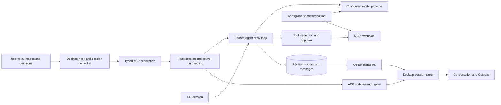

# 2026-09-05 — User workflow and data-flow repair

**Task:** Walk the primary user workflow and data flow, repair confirmed defects,
then review the repairs and fix further defects found in that review.

**Baseline:** `af6affaf8`; the working tree was clean at the start.

## Scope and method

This is a source walkthrough of provider/extension setup, Desktop session
creation/resume, prompt execution, tool interaction, cancellation, and persisted
history/Outputs. The CLI entry into the shared agent was also traced. Focused
tests exercise the repaired boundaries with the real Desktop session store and
controlled asynchronous transport responses. This is not a live provider or
packaged Electron acceptance run, nor an exhaustive repository security audit.

`AGENTS.md`, `README.md`, `docs/INDEX.md`, the relevant architecture documents,
advisory Giles metadata, and recent session evidence were consulted. `GEMINI.md`
does not exist in this checkout. The agent-skills-catalog instructions were read;
its MCP search/load tools were not exposed in this session. The July Giles
metadata records an earlier scan crash and remains advisory, not current
compliance evidence. No agents were delegated work.

## User workflow walkthrough

| User action                               | Code path and data movement                                                                                                                                                                                                                                                                                                                                                                                                                                                                                                                                                                                    | Failure/recovery boundary                                                                                                                                                                                     |
| ----------------------------------------- | -------------------------------------------------------------------------------------------------------------------------------------------------------------------------------------------------------------------------------------------------------------------------------------------------------------------------------------------------------------------------------------------------------------------------------------------------------------------------------------------------------------------------------------------------------------------------------------------------------------- | ------------------------------------------------------------------------------------------------------------------------------------------------------------------------------------------------------------- |
| Configure a provider and extensions       | Desktop [config adapter](../../../ui/desktop/src/acp/config.ts) calls ACP [config handlers](../../../crates/gosling/src/acp/server/config.rs). Secret reads are masked. Extension [environment resolution](../../../crates/gosling/src/agents/extension_manager/environment.rs) combines configured values, requested secret keys, and declared keychain sources; the [extension manager](../../../crates/gosling/src/agents/extension_manager.rs) passes resolved values into MCP transports.                                                                                                                 | Configuration/credential errors surface before an extension is usable. Substitution must preserve the exact bytes of resolved values.                                                                         |
| Choose a workspace and start a chat       | Desktop [session adapter](../../../ui/desktop/src/acp/sessions.ts) sends `cwd`, workspace and explicit launch options. Rust [new-session handling](../../../crates/gosling/src/acp/server/new_session.rs) prepares the authoritative workspace context, validates the directory, and creates/configures the session.                                                                                                                                                                                                                                                                                           | A session pins its working directory/profile context; renderer hints do not replace backend workspace validation.                                                                                             |
| Resume a saved chat                       | The [controller](../../../ui/desktop/src/acp/chatSessionController.ts) starts replay state, obtains session metadata, loads a compacted tail, fetches Outputs, and marks the snapshot loaded. Rust [load-session handling](../../../crates/gosling/src/acp/server/load_session.rs) restores the agent/extensions and replays persisted messages; earlier pages load on demand.                                                                                                                                                                                                                                 | Concurrent callers must share the complete load operation. Errors leave a retryable load error; successful loads are cached against the ACP connection generation.                                            |
| Send text/images                          | [useChatSession](../../../ui/desktop/src/hooks/useChatSession.ts) checks readiness and updates the visible message list. The controller reserves a prompt attempt and acquires the wakelock. The [prompt adapter](../../../ui/desktop/src/acp/prompt.ts) converts text, images, and audience annotations into ACP content.                                                                                                                                                                                                                                                                                     | Stop during preparation must prevent the delayed prompt from being sent. Active/cancelling attempts prevent overlapping submissions.                                                                          |
| Receive a reply or answer a tool question | Rust [prompt execution](../../../crates/gosling/src/acp/server/prompt_execution.rs) registers an active run and calls the shared agent. [Reply entry](../../../crates/gosling/src/agents/agent/reply_entry.rs) acquires a turn lease and persists accepted user input. The [reply loop](../../../crates/gosling/src/agents/agent/reply_stream.rs) streams provider output, inspects tool requests, obtains required approval, and dispatches MCP calls. Desktop [notifications](../../../ui/desktop/src/acp/chatNotifications.ts) update the [session store](../../../ui/desktop/src/acp/chatSessionStore.ts). | Permission/elicitation responses are session-scoped. A failed Stop must leave unanswered questions usable and restore the running state.                                                                      |
| Stop, finish, and reopen                  | ACP [active-run cancellation](../../../crates/gosling/src/acp/server/active_runs.rs) signals the run token; prompt execution records a terminal state. [Message storage](../../../crates/gosling/src/session/session_manager/message_storage.rs) persists messages and discovers artifact metadata in the transaction. Desktop clears the matching attempt and refreshes completion state.                                                                                                                                                                                                                     | Cancellation stays pending until the original prompt settles. A late cancellation callback must not consume a newer prompt's questions. Finishing an older prompt must not release a newer prompt's wakelock. |

The CLI uses [session construction](../../../crates/gosling-cli/src/session/builder.rs)
for configuration and create/resume, then calls the same `Agent::reply` from
[session execution](../../../crates/gosling-cli/src/session/mod.rs), with its own
terminal rendering and Ctrl-C cancellation handling.

## Data ownership

The renderer owns draft/display state; Rust owns accepted conversation history,
agent execution, permission policy, and durable session data. Artifact inventory
is metadata: listing an Output does not itself grant file access. Preview/export
authorization remains under the Electron file-access boundary described in the
[architecture document](../../architecture.md).

## Confirmed defects and repairs

1. **Stop before prompt submission:** the controller awaited the wakelock, then
   sent the prompt even if Stop had already marked it cancelled. It now consumes
   that cancellation before issuing the prompt. Stop during preparation sends
   no backend cancellation for a prompt that has not been dispatched.
2. **Failed Stop strands the session:** cancellation failure left an idle-looking
   UI with a pending cancellation barrier and consumed tool questions. The
   controller now restores the prior attempt on failure and cancels local
   questions only after the cancellation send succeeds, fenced to that attempt.
   If the prompt settles first, its pending questions are cancelled before the
   cancellation barrier is released, so cleanup cannot consume a later prompt's
   questions.
3. **Overlapping resume resets history:** the transport-level load promise ended
   before the controller finished loading Outputs. Another caller could reset
   replay state in that interval. Controller-level sharing now covers the full
   load and preserves each caller's completion callback; failed loads release
   the shared operation so retry can proceed.
4. **Completion releases the next prompt's wakelock:** the second review's
   immediate-next-prompt test reproduced this. Cleanup now releases the wakelock
   only when the session has neither an active nor a cancelling prompt.
5. **Extension interpolation changes or misses values:** mixed braced/simple
   references, variable names sharing a prefix, and dollar signs inside resolved
   values expose the multi-pass replacement defect. A single regex replacement
   pass now matches only the original template, inserts resolved values literally,
   and preserves unknown references. The new Rust regression failed before repair
   with `${KEY}/$KEY` producing `xyz/$KEY` instead of `xyz/xyz`.

The first three lifecycle regressions failed against the baseline, then passed
after repair. Additional review tests cover cancellation settlement, late
cancellation callbacks, retry after load failure, and immediate next-prompt
startup; the latter found defect 4 before its repair.
The late-cancellation test was extended to verify both old-question cleanup and
new-question preservation; that exposed and closed a cleanup gap in the first
cancellation patch.

## Validation

- `pnpm --dir ui/desktop test:run src/acp src/hooks/useChatSession.test.tsx`:
  **144/144 passed**, across 17 files, on the final Desktop revision.
- `pnpm --dir ui/desktop run typecheck`: **passed** on the final revision.
- Focused ESLint with `--max-warnings 0` and Prettier checks for all three changed
  Desktop files: **passed**.
- `cargo test -p gosling --lib agents::extension_manager::`: **55/55 passed**,
  including the new regression, secret-source resolution, header forwarding,
  OAuth, environment handling, and tool dispatch tests.
- `cargo fmt --all`: **completed** without unrelated source changes.
- `git diff --check`: **passed**. All 20 local report links resolve; the required
  `GILES:DOCS-GOVERNANCE:START` marker remains in `AGENTS.md`.
- `cargo clippy -p gosling --all-targets -- -D warnings`: **passed**.
- `cargo fmt --all -- --check`: **passed**.

All package/toolchain commands used `source bin/activate-hermit`. The final diff
review found no remaining issue in the changed code. These are scoped checks,
not a claim that every repository test or live acceptance scenario ran.

## Files and limits

Repairs and regressions are in `ui/desktop/src/acp/chatSessionController.ts`,
`ui/desktop/src/acp/__tests__/chatSessionController.test.ts`,
`ui/desktop/src/acp/__tests__/chatSessionLifecycle.test.ts`, and the Rust extension
environment helper/tests. `.gitignore` retains this session record using the
existing explicit exception convention.

No dependency, database schema, or public ACP contract change is required.
Validation does not establish live OS sleep behavior, real-provider execution,
keychain availability, every extension's compatibility, or packaged Desktop
acceptance. Those require an appropriate live environment and remain outside
the claims of this focused repair run.

Pre-existing documentation follow-up: `README.md` still describes `v1.1.0` as
the next release candidate, while the current Cargo and Desktop manifests use
`1.2.0`. This walkthrough uses source behavior as evidence and does not reconcile
release status or rewrite historical release-validation claims.
